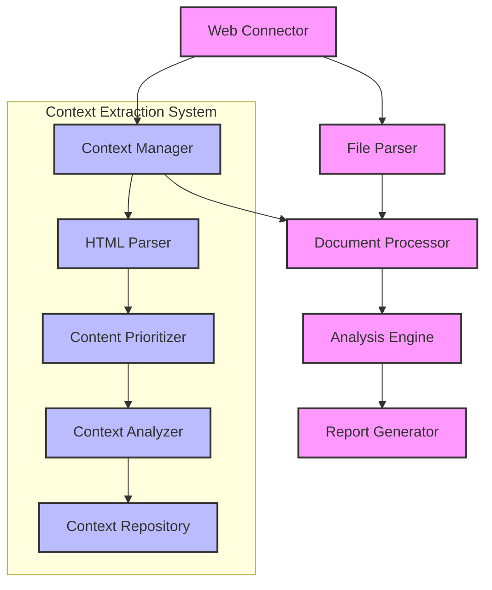

# Document-it

[](https://github.com/yourrepository/document-it)
[](https://opensource.org/licenses/MIT)
[](https://www.python.org)

A powerful tool to document LLMs by analyzing web documents with global context awareness.

## Table of Contents

- [Overview](#overview)
- [Architecture](#architecture)
- [Features](#features)
- [Installation](#installation)
- [Configuration](#configuration)
- [Usage](#usage)
  - [Basic Usage](#basic-usage)
  - [Advanced Usage](#advanced-usage)
  - [Example Scenarios](#example-scenarios)
- [Command-line Options](#command-line-options)
- [Output Structure](#output-structure)
- [License](#license)

## Overview

Document-it is a Python application that connects to websites, retrieves document references, analyzes them using LangGraph with GPT-4o, and generates implementation guidelines. What sets Document-it apart is its **global context extraction** capability, which maintains awareness of the product's purpose, features, and terminology throughout the documentation analysis, even when examining deep links or individual sections.

The application follows these steps:
1. Connect to a website and download a file containing document references
2. Parse the file to extract document references
3. Download and organize the referenced documents
4. Extract global context from the product's root/landing page
5. Analyze the documents with LangGraph + GPT-4o, maintaining global context awareness
6. Generate comprehensive implementation guidelines in markdown format

## Architecture



## Features

- **Web Connector**: Connect to websites and download files
  - Content type detection and filename extraction
  - Comprehensive error handling
  
- **File Parser**: Extract document references from markdown files
  - Markdown links parsing
  - Document structure extraction
  - URL validation and normalization
  - Document categorization

- **Document Processor**: Download and organize referenced documents
  - Batch processing with concurrent downloads
  - Document organization by category
  - Metadata extraction and indexing

- **Global Context Extraction**: Maintain product awareness across deep links
  - HTML structure parsing with parent-child relationships
  - Content prioritization based on relevance
  - Context extraction from root/landing page
  - Context storage and versioning
  - Context enrichment from analyzed documents

- **Analysis Engine**: Analyze documents using LangGraph with GPT-4o
  - LangGraph workflow configuration
  - Document analysis and concept extraction
  - Implementation pattern extraction
  - Topic synthesis across documents
  - Context-aware document analysis

- **Report Generator**: Create implementation guidelines from analysis results
  - Markdown document generation
  - Topic guideline generation with structured sections
  - Cross-reference creation between related topics
  - Index document generation with topic summaries
  - Context-aware guideline generation

## Installation

```bash
# Clone the repository
git clone https://github.com/yourusername/document-it.git
cd document-it

# Install dependencies using UV (as required by project standards)
uv sync
```

## Configuration

Create a `.env` file in the project root with the following content:

```
# OpenAI API Key
OPENAI_API_KEY=your_openai_api_key_here

# LangGraph Configuration
LANGGRAPH_TRACING_V2=true

# Logging Level
LOG_LEVEL=INFO
```

## Usage

### Basic Usage

Run the application with default settings:

```bash
# Run using the Python module
uv run python -m document_it

# Or use the main script directly
uv run python main.py
```

### Advanced Usage

Run with custom options to specify URL, analyze more documents, and generate guidelines:

```bash
# Analyze a specific URL with more documents
uv run python main.py --url https://docs.agno.com/llms.txt --analyze-count 10 --generate-guidelines

# Extract global context from a root page
uv run python main.py --root-page https://agno.com/product --generate-guidelines

# Test context extraction with visualization
uv run python main.py --root-page https://agno.com/product --test-context --visualize-context-extraction
```

### Example Scenarios

**Scenario 1: Basic documentation analysis**
```bash
uv run python main.py
```
This will:
- Download docs from default URL (https://docs.agno.com/llms.txt)
- Parse and extract document references
- Download and process 10 documents
- Analyze 3 documents (default)
- Results will be in data/output/

**Scenario 2: Comprehensive analysis with global context**
```bash
uv run python main.py --root-page https://agno.com/product --analyze-count 10 --generate-guidelines
```
This will:
- Extract global context from the product's root page
- Download and analyze 10 documents
- Generate implementation guidelines with global context awareness
- Results will be in data/output/guidelines/

**Scenario 3: Context extraction testing**
```bash
uv run python main.py --root-page https://agno.com/product --test-context --visualize-context-extraction
```
This will:
- Extract global context from the product's root page
- Generate detailed context extraction information
- Create a visualization of the context extraction process
- Results will be in data/output/context/

## Command-line Options

| Option | Description | Default |
|--------|-------------|---------|
| `--url` | URL of the llms.txt file | https://docs.agno.com/llms.txt |
| `--root-page` | URL of the product's root/landing page for context extraction | (inferred from --url) |
| `--output-dir` | Directory to store output files | data/output |
| `--context-dir` | Directory to store global context data | data/context |
| `--max-workers` | Maximum number of concurrent downloads | 5 |
| `--analyze-count` | Number of documents to analyze | 3 |
| `--generate-guidelines` | Generate implementation guidelines | False |
| `--test-context` | Output detailed context extraction information | False |
| `--visualize-context-extraction` | Generate a visualization of the context extraction process | False |
| `--verbose` | Enable verbose logging | False |

## Output Structure

```
data/
├── raw/
│   ├── llms.txt                     # Downloaded file with document references
│   └── documents/                   # Downloaded documents organized by category
│
├── processed/
│   └── document_refs.json           # Extracted document references
│
├── metadata/
│   └── document_index.json          # Metadata for downloaded documents
│
├── context/                         # Global context data
│   └── context_repository.json      # Stored context information
│
└── output/
    ├── analysis_*.json              # Analysis results for each document
    ├── context/                     # Context extraction output (when --test-context is used)
    │   ├── global_context_summary.md # Summary of extracted global context
    │   ├── global_context_debug.json # Debug information about context extraction
    │   ├── root_page.html           # Original HTML of the root page
    │   └── context_extraction_process.md # Visualization of the extraction process
    │
    └── guidelines/                  # Generated guidelines (when --generate-guidelines is used)
        ├── global_context.md        # Global context summary
        ├── topic_*.md               # Guidelines for each topic
        └── index.md                 # Index of all guidelines
```

## License

MIT