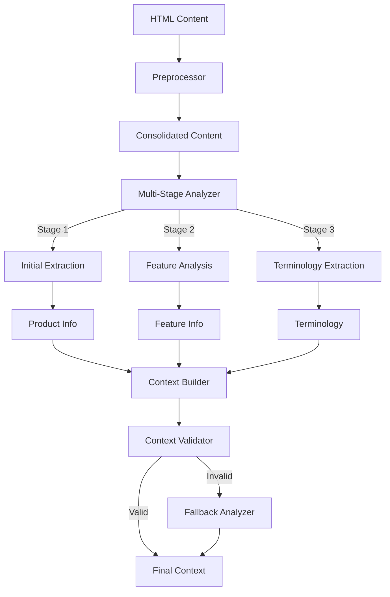

# Context Analyzer Design

## Overview

The Context Analyzer is responsible for extracting, enriching, and validating global context information from web page content. It employs advanced LLM-based analysis techniques to derive product information, features, terminology, and other contextual elements essential for comprehensive documentation understanding.

## Architecture



## Key Components

### 1. Preprocessor

The preprocessor prepares the raw HTML content for analysis:

```python
class ContentPreprocessor:
    """Preprocesses HTML content for context analysis."""
    
    def __init__(self):
        """Initialize the preprocessor."""
        pass
    
    def preprocess(self, consolidated_content):
        """
        Preprocess consolidated content for analysis.
        
        Args:
            consolidated_content: Consolidated content from root and linked pages
            
        Returns:
            Preprocessed content optimized for LLM analysis
        """
        # Initialize preprocessed content
        preprocessed = {
            "root_page": self._preprocess_page(consolidated_content["root_page"]),
            "linked_pages": [],
            "global_sections": {},
        }
        
        # Preprocess linked pages
        for page in consolidated_content["linked_pages"]:
            preprocessed["linked_pages"].append(self._preprocess_page(page))
        
        # Preprocess global sections
        for section_type, sections in consolidated_content["global_sections"].items():
            preprocessed["global_sections"][section_type] = self._preprocess_sections(sections)
        
        return preprocessed
    
    def _preprocess_page(self, page):
        """Preprocess a single page."""
        # Extract essential text content
        essential_content = self._extract_essential_content(page)
        
        # Format content for LLM consumption
        formatted_content = self._format_content_for_llm(essential_content, page["title"])
        
        return {
            "title": page["title"],
            "url": page.get("url", ""),
            "formatted_content": formatted_content,
            "metadata": page["metadata"],
        }
    
    def _extract_essential_content(self, page):
        """Extract essential content from a page."""
        essential = []
        
        # Add title
        if page["title"]:
            essential.append(f"Title: {page['title']}")
        
        # Add metadata
        if "description" in page["metadata"]:
            essential.append(f"Description: {page['metadata']['description']}")
        
        # Add headings with content
        for id, section in page["sections"].items():
            if section["heading"]:
                essential.append(f"## {section['heading']}")
            essential.append(section["content"])
        
        return "\n\n".join(essential)
    
    def _format_content_for_llm(self, content, title):
        """Format content for optimal LLM analysis."""
        # Remove excessive whitespace
        content = re.sub(r'\s+', ' ', content)
        
        # Split into manageable chunks
        chunks = self._split_into_chunks(content, max_length=4000)
        
        # Format each chunk
        formatted_chunks = []
        for i, chunk in enumerate(chunks):
            chunk_header = f"{title} (Part {i+1}/{len(chunks)})"
            formatted_chunks.append(f"{chunk_header}\n\n{chunk}")
        
        return formatted_chunks
    
    def _split_into_chunks(self, text, max_length=4000):
        """Split text into chunks of maximum length."""
        # Simple chunking by character count
        chunks = []
        current_chunk = ""
        
        paragraphs = text.split("\n\n")
        
        for paragraph in paragraphs:
            if len(current_chunk) + len(paragraph) > max_length:
                chunks.append(current_chunk)
                current_chunk = paragraph
            else:
                current_chunk += "\n\n" + paragraph if current_chunk else paragraph
        
        if current_chunk:
            chunks.append(current_chunk)
        
        return chunks
    
    def _preprocess_sections(self, sections):
        """Preprocess a list of sections."""
        processed_sections = []
        
        for section in sections:
            processed_sections.append({
                "name": section["name"],
                "content": re.sub(r'\s+', ' ', section["content"]),
                "id": section["id"],
            })
        
        return processed_sections
```

### 2. Multi-Stage Analyzer

The multi-stage analyzer processes content in distinct phases:

```python
class MultiStageAnalyzer:
    """Multi-stage content analyzer using LLMs."""
    
    def __init__(self, api_key=None, model="gpt-4o"):
        """
        Initialize the analyzer.
        
        Args:
            api_key: OpenAI API key
            model: Model to use for analysis
        """
        self.api_key = api_key or os.getenv("OPENAI_API_KEY")
        self.model = model
        self.llm = ChatOpenAI(
            model=model,
            temperature=0.1,
            api_key=self.api_key
        )
    
    async def analyze(self, preprocessed_content):
        """
        Analyze content in multiple stages.
        
        Args:
            preprocessed_content: Preprocessed content
            
        Returns:
            Analysis results for all stages
        """
        # Stage 1: Extract basic product information
        product_info = await self._stage1_product_info(preprocessed_content)
        
        # Stage 2: Analyze features
        features = await self._stage2_feature_analysis(
            preprocessed_content, product_info
        )
        
        # Stage 3: Extract terminology
        terminology = await self._stage3_terminology_extraction(
            preprocessed_content, product_info
        )
        
        # Combine results
        return {
            "product_info": product_info,
            "features": features,
            "terminology": terminology,
        }
    
    async def _stage1_product_info(self, content):
        """Stage 1: Extract basic product information."""
        # Focus on root page content
        root_content = content["root_page"]["formatted_content"]
        
        # Prepare prompt 
        prompt = STAGE1_PRODUCT_INFO_PROMPT.format(
            content=root_content[0] if root_content else "No content available"
        )
        
        # Call LLM
        messages = [
            SystemMessage(content="You are an expert technical documentation analyzer."),
            HumanMessage(content=prompt)
        ]
        
        response = await self.llm.ainvoke(messages)
        
        # Parse response
        try:
            result = json.loads(response.content)
            return result
        except json.JSONDecodeError:
            # Try to extract JSON using regex
            import re
            json_match = re.search(r'```json\n(.*?)\n```', response.content, re.DOTALL)
            if json_match:
                return json.loads(json_match.group(1))
            else:
                raise ValueError("Failed to parse product info as JSON")
    
    async def _stage2_feature_analysis(self, content, product_info):
        """Stage 2: Analyze features."""
        # Combine root page and feature sections
        feature_content = []
        
        # Add root page content
        for chunk in content["root_page"]["formatted_content"]:
            feature_content.append(chunk)
        
        # Add feature sections from linked pages
        if "features" in content["global_sections"]:
            for feature in content["global_sections"]["features"]:
                feature_content.append(f"## {feature['name']}\n\n{feature['content']}")
        
        # Add content from pages with "feature" in title
        for page in content["linked_pages"]:
            if "feature" in page["title"].lower():
                for chunk in page["formatted_content"]:
                    feature_content.append(chunk)
        
        # Process in batches to handle potentially large content
        all_features = []
        for i in range(0, len(feature_content), 3):
            batch = feature_content[i:i+3]
            batch_content = "\n\n---\n\n".join(batch)
            
            # Prepare prompt 
            prompt = STAGE2_FEATURE_ANALYSIS_PROMPT.format(
                product_name=product_info["product_name"],
                product_description=product_info["product_description"],
                content=batch_content
            )
            
            # Call LLM
            messages = [
                SystemMessage(content="You are an expert feature analyzer."),
                HumanMessage(content=prompt)
            ]
            
            response = await self.llm.ainvoke(messages)
            
            # Parse response and add to features
            try:
                batch_features = json.loads(response.content)
                all_features.extend(batch_features)
            except (json.JSONDecodeError, ValueError):
                # Try to extract JSON using regex
                import re
                json_match = re.search(r'```json\n(.*?)\n```', response.content, re.DOTALL)
                if json_match:
                    batch_features = json.loads(json_match.group(1))
                    all_features.extend(batch_features)
        
        # Deduplicate features
        deduplicated_features = self._deduplicate_features(all_features)
        
        return deduplicated_features
    
    def _deduplicate_features(self, features):
        """Deduplicate features based on name."""
        feature_dict = {}
        
        for feature in features:
            name = feature["name"]
            
            if name in feature_dict:
                # Merge with existing feature
                existing = feature_dict[name]
                
                # Use longer description
                if len(feature["description"]) > len(existing["description"]):
                    existing["description"] = feature["description"]
                
                # Use higher importance if provided
                if feature["importance"] > existing["importance"]:
                    existing["importance"] = feature["importance"]
                
                # Merge related features
                existing["related_features"] = list(set(
                    existing["related_features"] + feature["related_features"]
                ))
            else:
                # Add new feature
                feature_dict[name] = feature
        
        return list(feature_dict.values())
    
    async def _stage3_terminology_extraction(self, content, product_info):
        """Stage 3: Extract terminology."""
        # Focus on documentation and terminology sections
        terminology_content = []
        
        # Add content from pages with "documentation" or "terminology" in title
        for page in content["linked_pages"]:
            page_title = page["title"].lower()
            if any(term in page_title for term in ["doc", "terminology", "glossary", "concept"]):
                for chunk in page["formatted_content"]:
                    terminology_content.append(chunk)
        
        # Add terminology sections
        if "terminology" in content["global_sections"]:
            for term_section in content["global_sections"]["terminology"]:
                terminology_content.append(
                    f"## {term_section['name']}\n\n{term_section['content']}"
                )
        
        # If no terminology content found, use root page
        if not terminology_content and content["root_page"]["formatted_content"]:
            terminology_content = content["root_page"]["formatted_content"]
        
        # Process in batches
        all_terms = {}
        for chunk in terminology_content:
            # Prepare prompt 
            prompt = STAGE3_TERMINOLOGY_EXTRACTION_PROMPT.format(
                product_name=product_info["product_name"],
                product_description=product_info["product_description"],
                content=chunk
            )
            
            # Call LLM
            messages = [
                SystemMessage(content="You are an expert terminology extractor."),
                HumanMessage(content=prompt)
            ]
            
            response = await self.llm.ainvoke(messages)
            
            # Parse response and add to terminology
            try:
                terms = json.loads(response.content)
                all_terms.update(terms)
            except (json.JSONDecodeError, ValueError):
                # Try to extract JSON using regex
                import re
                json_match = re.search(r'```json\n(.*?)\n```', response.content, re.DOTALL)
                if json_match:
                    terms = json.loads(json_match.group(1))
                    all_terms.update(terms)
        
        return all_terms
```

### 3. Context Builder

The context builder assembles the final context object:

```python
class ContextBuilder:
    """Builds a global context from analysis results."""
    
    def __init__(self):
        """Initialize the context builder."""
        pass
    
    def build_context(self, analysis_results):
        """
        Build a GlobalContext object from analysis results.
        
        Args:
            analysis_results: Results from MultiStageAnalyzer
            
        Returns:
            GlobalContext object
        """
        from document_it.context.models import GlobalContext, ProductFeature
        
        # Create the context object
        context = GlobalContext()
        
        # Add product information
        product_info = analysis_results["product_info"]
        context.product_name = product_info["product_name"]
        context.product_description = product_info["product_description"]
        context.primary_purpose = product_info["primary_purpose"]
        context.target_audience = product_info["target_audience"]
        context.confidence_score = product_info["confidence_score"]
        
        # Add features
        for feature in analysis_results["features"]:
            feature_obj = ProductFeature(
                name=feature["name"],
                description=feature["description"],
                importance=feature["importance"],
                related_features=feature["related_features"]
            )
            context.main_features[feature["name"]] = feature_obj
        
        # Add terminology
        context.terminology = analysis_results["terminology"]
        
        # Add categories
        if "categories" in product_info:
            context.categories = product_info["categories"]
        
        return context
```

### 4. Context Validator

The context validator ensures the extracted context is complete and accurate:

```python
class ContextValidator:
    """Validates a global context for completeness and accuracy."""
    
    def __init__(self, min_confidence=0.5, min_features=1):
        """
        Initialize the validator.
        
        Args:
            min_confidence: Minimum confidence score
            min_features: Minimum number of features
        """
        self.min_confidence = min_confidence
        self.min_features = min_features
    
    def validate(self, context):
        """
        Validate a GlobalContext object.
        
        Args:
            context: GlobalContext to validate
            
        Returns:
            (is_valid, issues) tuple
        """
        issues = []
        
        # Check product name
        if not context.product_name:
            issues.append("Missing product name")
        
        # Check product description
        if not context.product_description:
            issues.append("Missing product description")
        
        # Check primary purpose
        if not context.primary_purpose:
            issues.append("Missing primary purpose")
        
        # Check features
        if len(context.main_features) < self.min_features:
            issues.append(f"Insufficient features (got {len(context.main_features)}, need {self.min_features})")
        
        # Check confidence score
        if context.confidence_score < self.min_confidence:
            issues.append(f"Low confidence score: {context.confidence_score}")
        
        # Result
        is_valid = len(issues) == 0
        
        return (is_valid, issues)
```

### 5. Fallback Analyzer

The fallback analyzer provides a simplified analysis when the main approach fails:

```python
class FallbackAnalyzer:
    """Fallback analyzer for when main analysis fails."""
    
    def __init__(self, api_key=None, model="gpt-4o"):
        """
        Initialize the analyzer.
        
        Args:
            api_key: OpenAI API key
            model: Model to use for analysis
        """
        self.api_key = api_key or os.getenv("OPENAI_API_KEY")
        self.model = model
        self.llm = ChatOpenAI(
            model=model,
            temperature=0.1,
            api_key=self.api_key
        )
    
    async def analyze(self, content, validation_issues):
        """
        Perform fallback analysis.
        
        Args:
            content: Preprocessed content
            validation_issues: Issues from validation
            
        Returns:
            GlobalContext object
        """
        from document_it.context.models import GlobalContext
        
        # Extract text from root page
        root_text = "\n\n".join(content["root_page"]["formatted_content"])
        
        # Prepare prompt with validation issues
        prompt = FALLBACK_ANALYSIS_PROMPT.format(
            content=root_text[:8000],  # Limit content length
            validation_issues="\n".join(validation_issues)
        )
        
        # Call LLM
        messages = [
            SystemMessage(content="You are an expert context analyzer."),
            HumanMessage(content=prompt)
        ]
        
        response = await self.llm.ainvoke(messages)
        
        # Parse response
        try:
            result = json.loads(response.content)
            context = GlobalContext.from_dict(result)
            # Mark as fallback
            context.is_fallback = True
            return context
        except (json.JSONDecodeError, ValueError):
            # Create minimal context as last resort
            context = GlobalContext(
                product_name=content["root_page"]["title"],
                product_description="No description available.",
                primary_purpose="Unknown",
                target_audience=["Unknown"],
                confidence_score=0.1,
                is_fallback=True
            )
            return context
```

## Prompt Designs

### Stage 1: Product Information Extraction

```python
STAGE1_PRODUCT_INFO_PROMPT = """
You are an expert technical documentation analyzer. Your task is to extract key product information from the provided content.

Content:
{content}

Please extract the following information about the product:
1. Product Name: The name of the product being documented
2. Product Description: A comprehensive description of what the product is
3. Primary Purpose: The main purpose or goal of the product
4. Target Audience: Who this product is designed for
5. Categories: The main categories of functionality
6. Confidence Score: Your confidence level in the extraction (0.0-1.0)

Format your response as a structured JSON object with the following schema:
{
  "product_name": "string",
  "product_description": "string",
  "primary_purpose": "string",
  "target_audience": ["string"],
  "categories": {
    "category_name": "description"
  },
  "confidence_score": float (0.0-1.0)
}

The confidence_score field should reflect how confident you are in the extracted information based on how comprehensive and clear the documentation is.
"""
```

### Stage 2: Feature Analysis

```python
STAGE2_FEATURE_ANALYSIS_PROMPT = """
You are an expert feature analyzer. Your task is to identify and extract features of a product from the provided content.

Product: {product_name}
Description: {product_description}

Content:
{content}

Please extract all features mentioned in the content. For each feature, provide:
1. Name: A concise name for the feature
2. Description: A comprehensive description of the feature
3. Importance: A rating from 1-10 indicating how important this feature seems to be
4. Related Features: Names of other features that seem related

Format your response as a JSON array of feature objects with the following schema:
[
  {{
    "name": "string",
    "description": "string",
    "importance": integer (1-10),
    "related_features": ["string"]
  }}
]

Focus only on actual product features, not general concepts or benefits. Be specific and detailed in your descriptions.
"""
```

### Stage 3: Terminology Extraction

```python
STAGE3_TERMINOLOGY_EXTRACTION_PROMPT = """
You are an expert terminology extractor. Your task is to identify and extract important terms and their definitions from the provided content.

Product: {product_name}
Description: {product_description}

Content:
{content}

Please extract all important terms and their definitions from the content. Focus on:
1. Technical terms specific to the product
2. Domain-specific concepts
3. Abbreviations and acronyms
4. Components and elements of the product

Format your response as a JSON object mapping terms to their definitions:
{{
  "term1": "definition1",
  "term2": "definition2",
  ...
}}

Provide clear, concise definitions that would help someone understand the product documentation.
"""
```

### Fallback Analysis

```python
FALLBACK_ANALYSIS_PROMPT = """
You are an expert context analyzer. The main analysis pipeline has failed with the following issues:

{validation_issues}

Your task is to extract the most basic information about the product from the provided content to create a minimal but valid context.

Content:
{content}

Please extract:
1. Product Name: The name of the product (even if uncertain)
2. Product Description: A basic description
3. Primary Purpose: A simple statement of purpose
4. At least one main feature
5. Any terminology you can identify

Format your response as a structured JSON object with the following schema:
{
  "product_name": "string",
  "product_description": "string",
  "primary_purpose": "string",
  "target_audience": ["string"],
  "main_features": {
    "feature_name": {
      "name": "string",
      "description": "string",
      "importance": integer (1-10),
      "related_features": []
    }
  },
  "terminology": {
    "term": "definition"
  },
  "confidence_score": float (0.0-1.0)
}

Focus on extracting at least the minimum required information to create a valid context.
"""
```

## Integration with Context Manager

The Context Analyzer integrates with the Context Manager:

```python
# In ContextManager
async def initialize_from_url(self, url):
    """Initialize global context from a URL."""
    # Fetch and parse HTML content
    root_content = fetch_url_content(url)
    structured_document = parse_html_with_structure(root_content)
    
    # Follow links if configured
    if self.follow_links:
        # ... Link following code ...
        consolidated_content = consolidator.consolidate(structured_document, processed_pages)
    else:
        consolidated_content = {
            "root_page": structured_document_to_dict(structured_document),
            "linked_pages": [],
            "global_sections": {}
        }
    
    # Preprocess content
    preprocessor = ContentPreprocessor()
    preprocessed_content = preprocessor.preprocess(consolidated_content)
    
    # Analyze content
    analyzer = MultiStageAnalyzer()
    analysis_results = await analyzer.analyze(preprocessed_content)
    
    # Build context
    context_builder = ContextBuilder()
    context = context_builder.build_context(analysis_results)
    
    # Validate context
    validator = ContextValidator()
    is_valid, issues = validator.validate(context)
    
    # If invalid, try fallback
    if not is_valid:
        fallback_analyzer = FallbackAnalyzer()
        context = await fallback_analyzer.analyze(preprocessed_content, issues)
    
    # Store context
    self.repository.update_context(context, url)
    
    return context
```

## Performance Considerations

To optimize performance and cost:

1. **Chunking**: Split content into manageable chunks
2. **Parallelization**: Process stages in parallel where possible
3. **Caching**: Cache intermediate results
4. **Model Selection**: Use faster models for simpler tasks

## Error Handling

Comprehensive error handling includes:

1. **Parsing Failures**: Robust JSON parsing with regex fallbacks
2. **API Errors**: Retry logic for transient failures
3. **Content Issues**: Graceful handling of malformed or missing content
4. **Validation System**: Identify and address issues early

## Testing Strategy

The Context Analyzer will have thorough tests:

1. **Unit Tests** for each component
2. **Integration Tests** with mock content
3. **Prompt Testing** to ensure reliable extraction
4. **Error Handling Tests** with various failure modes
5. **Validation Tests** for context quality checks

## Implementation Schedule

The implementation should proceed in this order:

1. **Phase 1**: Basic content preprocessing
2. **Phase 2**: Stage 1 analysis (Product Info)
3. **Phase 3**: Context builder and validator
4. **Phase 4**: Stages 2-3 analysis
5. **Phase 5**: Fallback analyzer
6. **Phase 6**: Integration and optimization

## Success Metrics

The Context Analyzer's success will be measured by:

1. **Extraction Accuracy**: Correctly identifying product name, purpose, etc.
2. **Feature Coverage**: Identifying all major product features
3. **Terminology Completeness**: Extracting relevant technical terms
4. **Confidence Score Accuracy**: Correlation between confidence and actual quality
5. **Fallback Success Rate**: How often fallbacks produce useful contexts

## Conclusion

The Context Analyzer design provides a robust, multi-stage approach to extracting global product context from documentation. By breaking the analysis into distinct stages and implementing validation and fallback mechanisms, it ensures high-quality context extraction even from complex or incomplete documentation.