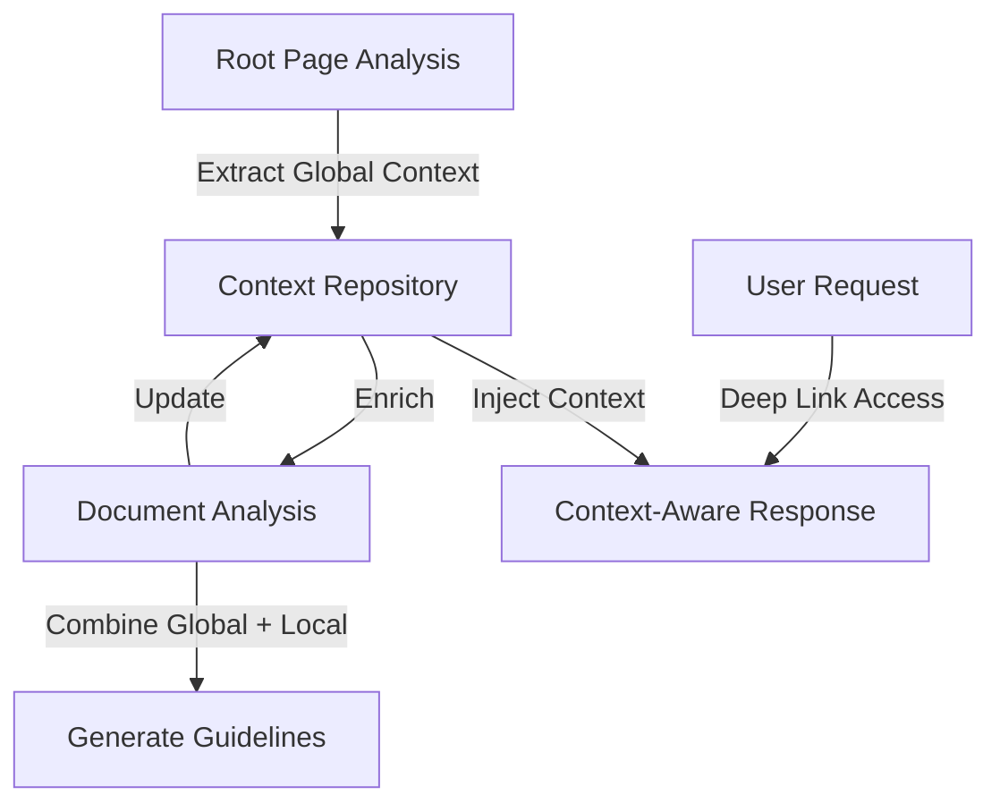

# Global Context Management Implementation Plan

This document outlines the plan for implementing global context management in the document-it project to address the issue of losing context when accessing deep links.

## Problem Statement

The current implementation analyzes each document in isolation without maintaining awareness of the overall product or documentation structure. When users access deep links (specific parts of the documentation), they lose the broader context about what the product is, its purpose, and main features. This can lead to:

1. Fragmented understanding of the documentation
2. Missed connections between related concepts
3. Repetitive or inconsistent information in generated guidelines
4. Lack of clarity about how specific features relate to the main product

## Solution Architecture



## New Module Structure

Create a new directory for context management:

```
document_it/context/
├── __init__.py
├── context_manager.py    # Main management logic
├── context_repository.py # Storage and retrieval
├── context_analyzer.py   # LLM-based context extraction
└── models.py            # Data structures and schemas
```

## 1. Context Data Structures

In `document_it/context/models.py`, implement these structures:

```python
from typing import Dict, List, Any, Optional
from dataclasses import dataclass, field
from datetime import datetime
import json

@dataclass
class ProductFeature:
    name: str
    description: str
    importance: int = 5  # 1-10 scale
    related_features: List[str] = field(default_factory=list)

@dataclass
class GlobalContext:
    product_name: str = ""
    product_description: str = ""
    primary_purpose: str = ""
    target_audience: List[str] = field(default_factory=list)
    main_features: Dict[str, ProductFeature] = field(default_factory=dict)
    categories: Dict[str, str] = field(default_factory=dict)
    terminology: Dict[str, str] = field(default_factory=dict)
    last_updated: datetime = field(default_factory=datetime.now)
    confidence_score: float = 0.0  # 0.0-1.0 indicating confidence in context quality
    
    def to_dict(self) -> Dict[str, Any]:
        """Convert to dictionary for serialization"""
        return {
            "product_name": self.product_name,
            "product_description": self.product_description,
            "primary_purpose": self.primary_purpose,
            "target_audience": self.target_audience,
            "main_features": {
                name: {
                    "name": feature.name,
                    "description": feature.description,
                    "importance": feature.importance,
                    "related_features": feature.related_features
                } for name, feature in self.main_features.items()
            },
            "categories": self.categories,
            "terminology": self.terminology,
            "last_updated": self.last_updated.isoformat(),
            "confidence_score": self.confidence_score
        }
    
    @classmethod
    def from_dict(cls, data: Dict[str, Any]) -> 'GlobalContext':
        """Create from dictionary"""
        context = cls(
            product_name=data.get("product_name", ""),
            product_description=data.get("product_description", ""),
            primary_purpose=data.get("primary_purpose", ""),
            target_audience=data.get("target_audience", []),
            categories=data.get("categories", {}),
            terminology=data.get("terminology", {}),
            confidence_score=data.get("confidence_score", 0.0)
        )
        
        # Convert feature dictionaries to objects
        for name, feature_data in data.get("main_features", {}).items():
            context.main_features[name] = ProductFeature(
                name=feature_data.get("name", name),
                description=feature_data.get("description", ""),
                importance=feature_data.get("importance", 5),
                related_features=feature_data.get("related_features", [])
            )
        
        # Parse datetime
        if "last_updated" in data:
            try:
                context.last_updated = datetime.fromisoformat(data["last_updated"])
            except ValueError:
                context.last_updated = datetime.now()
                
        return context

@dataclass
class ContextEnrichment:
    """Records an update to the global context"""
    source_document: str
    timestamp: datetime = field(default_factory=datetime.now)
    added_features: List[str] = field(default_factory=list)
    updated_features: List[str] = field(default_factory=list)
    added_terminology: List[str] = field(default_factory=list)
    confidence_change: float = 0.0
```

## 2. Context Repository Implementation

In `document_it/context/context_repository.py`:

```python
import json
import logging
from pathlib import Path
from typing import Optional, List
from datetime import datetime

from document_it.context.models import GlobalContext, ContextEnrichment

logger = logging.getLogger("document-it.context")

class ContextRepository:
    """Storage and retrieval for global context"""
    
    def __init__(self, data_dir: str = "data/context"):
        self.data_dir = Path(data_dir)
        self.context_file = self.data_dir / "global_context.json"
        self.history_dir = self.data_dir / "history"
        self.data_dir.mkdir(parents=True, exist_ok=True)
        self.history_dir.mkdir(parents=True, exist_ok=True)
        self._context: Optional[GlobalContext] = None
        self._enrichment_history: List[ContextEnrichment] = []
        
    def get_context(self) -> GlobalContext:
        """Get the current global context, loading from disk if necessary"""
        if self._context is None:
            self._load_context()
        return self._context
    
    def save_context(self) -> None:
        """Save the current context to disk"""
        if self._context is None:
            logger.warning("No context to save")
            return
            
        self.data_dir.mkdir(parents=True, exist_ok=True)
        
        # Save current version
        with open(self.context_file, "w", encoding="utf-8") as f:
            json.dump(self._context.to_dict(), f, indent=2)
            
        # Also save a timestamped version for history
        timestamp = datetime.now().strftime("%Y%m%d_%H%M%S")
        history_path = self.history_dir / f"context_{timestamp}.json"
        with open(history_path, "w", encoding="utf-8") as f:
            json.dump(self._context.to_dict(), f, indent=2)
            
        logger.info(f"Saved global context to {self.context_file}")
    
    def _load_context(self) -> None:
        """Load context from disk or create new if not exists"""
        if self.context_file.exists():
            try:
                with open(self.context_file, "r", encoding="utf-8") as f:
                    data = json.load(f)
                self._context = GlobalContext.from_dict(data)
                logger.info(f"Loaded global context from {self.context_file}")
            except Exception as e:
                logger.error(f"Error loading context: {str(e)}")
                self._context = GlobalContext()
        else:
            logger.info("No existing context found, creating new")
            self._context = GlobalContext()
    
    def update_context(self, new_context: GlobalContext, source_document: str) -> ContextEnrichment:
        """Update the global context and record the enrichment"""
        if self._context is None:
            self._load_context()
            
        # Record what's changing
        enrichment = ContextEnrichment(source_document=source_document)
        
        # Track added features
        for name, feature in new_context.main_features.items():
            if name not in self._context.main_features:
                self._context.main_features[name] = feature
                enrichment.added_features.append(name)
            else:
                # Update existing feature if new description is more detailed
                old_feature = self._context.main_features[name]
                if len(feature.description) > len(old_feature.description) * 1.2:  # 20% longer
                    self._context.main_features[name] = feature
                    enrichment.updated_features.append(name)
        
        # Update terminology
        for term, definition in new_context.terminology.items():
            if term not in self._context.terminology:
                self._context.terminology[term] = definition
                enrichment.added_terminology.append(term)
                
        # Update other fields if they're more complete
        if len(new_context.product_description) > len(self._context.product_description):
            self._context.product_description = new_context.product_description
            
        if len(new_context.primary_purpose) > len(self._context.primary_purpose):
            self._context.primary_purpose = new_context.primary_purpose
            
        # Merge target audiences
        for audience in new_context.target_audience:
            if audience not in self._context.target_audience:
                self._context.target_audience.append(audience)
                
        # Update categories
        for category, description in new_context.categories.items():
            if category not in self._context.categories:
                self._context.categories[category] = description
                
        # Update confidence score (weighted average)
        old_confidence = self._context.confidence_score
        new_confidence = new_context.confidence_score
        self._context.confidence_score = (old_confidence * 0.7) + (new_confidence * 0.3)
        enrichment.confidence_change = self._context.confidence_score - old_confidence
        
        # Update timestamp
        self._context.last_updated = datetime.now()
        
        # Save changes
        self.save_context()
        self._enrichment_history.append(enrichment)
        
        return enrichment
```

## 3. Context Analyzer Implementation

In `document_it/context/context_analyzer.py`:

```python
import json
import logging
import re
from typing import Dict, Any, Optional

from langchain_core.messages import HumanMessage, SystemMessage
from langchain_openai import ChatOpenAI
import openai

from document_it.context.models import GlobalContext

logger = logging.getLogger("document-it.context")

CONTEXT_EXTRACTION_PROMPT = """
You are an expert in technical documentation analysis. Your task is to extract global context about a product from its documentation. 

Document Content:
{document_content}

Please extract the following information about the product:
1. Product Name: The name of the product being documented
2. Product Description: A comprehensive description of what the product is
3. Primary Purpose: The main purpose or goal of the product
4. Target Audience: Who this product is designed for
5. Main Features: The key features and capabilities of the product
6. Categories: The main categories of functionality
7. Terminology: Important terms and their definitions

Format your response as a structured JSON object with the following schema:
{
  "product_name": "string",
  "product_description": "string",
  "primary_purpose": "string",
  "target_audience": ["string"],
  "main_features": {
    "feature_name": {
      "name": "string",
      "description": "string",
      "importance": integer (1-10),
      "related_features": ["string"]
    }
  },
  "categories": {
    "category_name": "description"
  },
  "terminology": {
    "term": "definition"
  },
  "confidence_score": float (0.0-1.0)
}

The confidence_score field should reflect how confident you are in the extracted information based on how comprehensive and clear the documentation is.
"""

CONTEXT_ENRICHMENT_PROMPT = """
You are an expert in technical documentation analysis. Your task is to analyze a document and extract information that can enrich our global context about the product.

Current Global Context:
{global_context}

New Document Content:
{document_content}

Please extract any information from this new document that:
1. Adds new features not in the current global context
2. Provides better descriptions of existing features
3. Adds new terminology
4. Clarifies the product purpose or target audience
5. Adds new categories

Format your response as a structured JSON object with the same schema as the current global context, but only include information that is new or improved:
{
  "product_name": "string",
  "product_description": "string (only if better than current)",
  "primary_purpose": "string (only if better than current)",
  "target_audience": ["string (only new ones)"],
  "main_features": {
    "feature_name": {
      "name": "string",
      "description": "string",
      "importance": integer (1-10),
      "related_features": ["string"]
    }
  },
  "categories": {
    "category_name": "description (only new ones)"
  },
  "terminology": {
    "term": "definition (only new ones)"
  },
  "confidence_score": float (0.0-1.0)
}

The confidence_score field should reflect how confident you are in the extracted information based on how comprehensive and clear the documentation is.
"""

class ContextAnalyzer:
    """Analyzes documents to extract and enrich global context"""
    
    def __init__(self, api_key: Optional[str] = None, model: str = "gpt-4o"):
        self.model = model
        self.api_key = api_key
        self.llm = ChatOpenAI(
            model=model,
            temperature=0.1,
            api_key=api_key
        )
        
    def extract_initial_context(self, document_content: str) -> GlobalContext:
        """Extract initial global context from root document"""
        try:
            logger.info("Extracting initial global context")
            
            # Prepare the prompt
            prompt = CONTEXT_EXTRACTION_PROMPT.format(document_content=document_content)
            
            # Call the LLM
            messages = [
                SystemMessage(content="You are an expert technical documentation analyzer."),
                HumanMessage(content=prompt)
            ]
            
            response = self.llm.invoke(messages)
            
            # Parse the response
            context_data = self._parse_json_response(response.content)
            context = GlobalContext.from_dict(context_data)
            
            logger.info(f"Extracted initial context with {len(context.main_features)} features")
            return context
            
        except Exception as e:
            logger.error(f"Error extracting initial context: {str(e)}")
            # Return empty context as fallback
            return GlobalContext()
    
    def enrich_context(self, current_context: GlobalContext, document_content: str) -> GlobalContext:
        """Enrich existing context with information from new document"""
        try:
            logger.info("Enriching global context")
            
            # Prepare the prompt
            prompt = CONTEXT_ENRICHMENT_PROMPT.format(
                global_context=json.dumps(current_context.to_dict(), indent=2),
                document_content=document_content
            )
            
            # Call the LLM
            messages = [
                SystemMessage(content="You are an expert technical documentation analyzer."),
                HumanMessage(content=prompt)
            ]
            
            response = self.llm.invoke(messages)
            
            # Parse the response
            enrichment_data = self._parse_json_response(response.content)
            enriched_context = GlobalContext.from_dict(enrichment_data)
            
            logger.info(f"Extracted enrichment with {len(enriched_context.main_features)} features")
            return enriched_context
            
        except Exception as e:
            logger.error(f"Error enriching context: {str(e)}")
            # Return minimal context with confidence=0 to indicate failure
            minimal_context = GlobalContext()
            minimal_context.confidence_score = 0.0
            return minimal_context
    
    def _parse_json_response(self, response_text: str) -> Dict[str, Any]:
        """Parse JSON from LLM response"""
        try:
            # First try direct JSON parsing
            return json.loads(response_text)
        except json.JSONDecodeError:
            # Try to extract JSON using regex
            json_match = re.search(r'```json\n(.*?)\n```', response_text, re.DOTALL)
            if json_match:
                return json.loads(json_match.group(1))
            else:
                # Last resort: try to find anything that looks like JSON
                potential_json = re.search(r'({[\s\S]*})', response_text)
                if potential_json:
                    return json.loads(potential_json.group(1))
                else:
                    raise ValueError("Failed to parse JSON from response")
```

## 4. Context Manager Implementation

In `document_it/context/context_manager.py`:

```python
import logging
import os
from typing import Dict, Any, Optional

from document_it.context.context_repository import ContextRepository
from document_it.context.context_analyzer import ContextAnalyzer
from document_it.context.models import GlobalContext, ContextEnrichment

logger = logging.getLogger("document-it.context")

class ContextManager:
    """Main interface for working with global context"""
    
    def __init__(self, data_dir: str = "data/context"):
        self.repository = ContextRepository(data_dir)
        self.analyzer = ContextAnalyzer(api_key=os.getenv("OPENAI_API_KEY"))
        
    def initialize_from_root_page(self, root_content: str) -> GlobalContext:
        """Initialize global context from root page content"""
        logger.info("Initializing global context from root page")
        
        # Extract context from root page
        initial_context = self.analyzer.extract_initial_context(root_content)
        
        # Store in repository
        self.repository._context = initial_context
        self.repository.save_context()
        
        return initial_context
    
    def get_context(self) -> GlobalContext:
        """Get the current global context"""
        return self.repository.get_context()
    
    def update_from_document(self, document_content: str, document_path: str) -> ContextEnrichment:
        """Update global context based on new document content"""
        current_context = self.repository.get_context()
        
        # Extract potential enrichments
        enriched_context = self.analyzer.enrich_context(current_context, document_content)
        
        # Update repository
        enrichment = self.repository.update_context(enriched_context, document_path)
        
        return enrichment
    
    def get_context_for_document(self, document_content: str) -> Dict[str, Any]:
        """
        Get context specifically relevant for a document.
        This filters the global context to include only relevant parts.
        """
        # Get full context
        context = self.repository.get_context()
        
        # Convert to dictionary for manipulation
        context_dict = context.to_dict()
        
        # TODO: Add logic to filter context to most relevant parts
        # For now, just return the full context
        
        return context_dict
    
    def export_context_summary(self) -> str:
        """Generate a human-readable summary of the global context"""
        context = self.repository.get_context()
        
        summary = f"# {context.product_name} Global Context\n\n"
        summary += f"## Product Description\n{context.product_description}\n\n"
        summary += f"## Primary Purpose\n{context.primary_purpose}\n\n"
        
        summary += "## Target Audience\n"
        for audience in context.target_audience:
            summary += f"- {audience}\n"
        summary += "\n"
        
        summary += "## Main Features\n"
        for name, feature in context.main_features.items():
            importance = "★" * min(feature.importance, 5)
            summary += f"### {name} {importance}\n"
            summary += f"{feature.description}\n\n"
            if feature.related_features:
                summary += "Related features: " + ", ".join(feature.related_features) + "\n\n"
        
        summary += "## Terminology\n"
        for term, definition in context.terminology.items():
            summary += f"**{term}**: {definition}\n\n"
        
        return summary
```

## 5. Context-aware Document Analysis

Update `document_it/analysis/prompts.py` with new context-aware prompts:

```python
# Add this to the existing prompts.py file

# Context-aware document analysis prompt
CONTEXT_AWARE_DOCUMENT_ANALYSIS_PROMPT = """
You are an expert technical documentation analyzer. Your task is to analyze the provided document in the context of the overall product.

Global Product Context:
{global_context}

Document Content:
{document_content}

Please analyze this document and provide the following information:
1. Key Concepts: Identify and explain the main concepts discussed in the document, especially how they relate to the global product context.
2. Implementation Details: Extract any implementation guidelines, patterns, or best practices.
3. Code Patterns: Identify any code patterns or structures mentioned.
4. Related Topics: List any related topics mentioned in the document, including connections to the main product features.

Format your response as a structured JSON object with the following keys:
- key_concepts: Array of objects with "name", "description", "importance" (1-10), and "relation_to_product" (how this concept relates to the overall product)
- implementation_details: Array of objects with "title", "description", and "scope" (whether this applies to a specific feature or the whole product)
- code_patterns: Array of objects with "name", "description", and "example" (if available)
- related_topics: Array of objects with "name", "relationship", and "global_feature" (which global feature this relates to, if any)

Focus on unique information specific to this document and avoid repeating general information already contained in the global context.
"""

# Context-aware concept extraction prompt
CONTEXT_AWARE_CONCEPT_EXTRACTION_PROMPT = """
You are an expert in knowledge extraction. Your task is to identify and extract the key concepts from the provided document within the context of the overall product.

Global Product Context:
{global_context}

Document Content:
{document_content}

Please extract the key concepts from this document. For each concept, provide:
1. Name: A concise name for the concept
2. Description: A clear explanation of what the concept is
3. Importance: A rating from 1-10 indicating how central this concept is to the document
4. Related Concepts: Other concepts that are closely related to this one
5. Context Integration: Explain how this concept fits into the global product context

Format your response as a structured JSON array of objects, each with the keys "name", "description", "importance", "related_concepts", and "context_integration".

Focus on technical concepts that are essential to understanding the document's subject matter, especially emphasizing what makes this document's information unique compared to the global context.
"""
```

## 6. Modify LangGraph Agent

Update `document_it/analysis/langgraph_agent.py` to integrate global context:

```python
# Add these imports at the top
from document_it.context.context_manager import ContextManager
from document_it.analysis.prompts import (
    CONTEXT_AWARE_DOCUMENT_ANALYSIS_PROMPT,
    CONTEXT_AWARE_CONCEPT_EXTRACTION_PROMPT,
)

# Update the WorkflowState TypedDict to include global context
class WorkflowState(TypedDict):
    """Type definition for the workflow state."""
    document_path: str
    document_url: str
    document_content: str
    global_context: Optional[Dict[str, Any]]  # Add this line
    analysis: Optional[DocumentAnalysis]
    concepts: Optional[List[Dict[str, Any]]]
    implementation_details: Optional[List[Dict[str, Any]]]
    error: Optional[str]

# Update analyze_document function
def analyze_document(state: WorkflowState) -> WorkflowState:
    """
    Analyze a document using GPT-4o with global context awareness.
    
    Args:
        state: The current workflow state
        
    Returns:
        Updated workflow state with analysis results
        
    Raises:
        AnalysisError: If the document cannot be analyzed
    """
    try:
        document_content = state["document_content"]
        document_path = state["document_path"]
        document_url = state["document_url"]
        global_context = state.get("global_context", {})
        
        # Initialize the LLM
        llm = ChatOpenAI(
            model="gpt-4o",
            temperature=0.1,
            api_key=os.getenv("OPENAI_API_KEY")
        )
        
        # Prepare the prompt with global context
        if global_context:
            prompt = CONTEXT_AWARE_DOCUMENT_ANALYSIS_PROMPT.format(
                document_content=document_content,
                global_context=json.dumps(global_context, indent=2)
            )
        else:
            # Fallback to original prompt if no global context
            prompt = DOCUMENT_ANALYSIS_PROMPT.format(document_content=document_content)
        
        # Call the LLM
        messages = [
            SystemMessage(content="You are an expert technical documentation analyzer."),
            HumanMessage(content=prompt)
        ]
        
        response = llm.invoke(messages)
        
        # Parse the response
        try:
            analysis_result = json.loads(response.content)
        except json.JSONDecodeError:
            # If the response is not valid JSON, try to extract JSON from the text
            import re
            json_match = re.search(r'```json\n(.*?)\n```', response.content, re.DOTALL)
            if json_match:
                analysis_result = json.loads(json_match.group(1))
            else:
                raise AnalysisError("Failed to parse analysis result as JSON")
        
        # Create the document analysis
        analysis = DocumentAnalysis(
            document_path=document_path,
            document_url=document_url,
            key_concepts=analysis_result.get("key_concepts", []),
            implementation_details=analysis_result.get("implementation_details", []),
            code_patterns=analysis_result.get("code_patterns", []),
            related_topics=analysis_result.get("related_topics", [])
        )
        
        # Update the state
        state["analysis"] = analysis
        
        # Update global context with new information from this document
        if global_context:
            try:
                context_manager = ContextManager()
                context_manager.update_from_document(document_content, document_path)
                logger.info(f"Updated global context with information from {document_path}")
            except Exception as e:
                logger.warning(f"Failed to update global context: {str(e)}")
        
        logger.info(f"Analyzed document: {document_path}")
        return state
    
    except Exception as e:
        logger.error(f"Error analyzing document: {str(e)}")
        state["error"] = f"Failed to analyze document: {str(e)}"
        return state

# Update extract_concepts in a similar way to use CONTEXT_AWARE_CONCEPT_EXTRACTION_PROMPT

# Update analyze_document_with_workflow function to include global context
def analyze_document_with_workflow(
    document_path: str,
    document_url: str
) -> Dict[str, Any]:
    """
    Analyze a document using the LangGraph workflow with global context awareness.
    
    Args:
        document_path: Path to the document
        document_url: URL of the document
        
    Returns:
        Analysis results
        
    Raises:
        AnalysisError: If the document cannot be analyzed
    """
    try:
        # Get global context
        context_manager = ContextManager()
        global_context = context_manager.get_context().to_dict()
        
        # Set up the workflow
        workflow = setup_langgraph_workflow()
        
        # Initialize the state with global context
        initial_state = WorkflowState(
            document_path=document_path,
            document_url=document_url,
            document_content="",
            global_context=global_context,  # Add global context to initial state
            analysis=None,
            concepts=None,
            implementation_details=None,
            error=None
        )
        
        # Run the workflow
        result = workflow.invoke(initial_state)
        
        # Check for errors
        if result.get("error"):
            raise AnalysisError(result["error"])
        
        # Return the analysis results
        return {
            "document_path": document_path,
            "document_url": document_url,
            "analysis": result.get("analysis"),
            "concepts": result.get("concepts"),
            "implementation_details": result.get("implementation_details")
        }
    
    except Exception as e:
        logger.error(f"Error analyzing document with workflow: {str(e)}")
        raise AnalysisError(f"Failed to analyze document with workflow: {str(e)}")
```

## 7. Update the Main Application Flow

Modify `main.py` to initialize and manage global context:

```python
# Add these imports
from document_it.context.context_manager import ContextManager
from bs4 import BeautifulSoup

# Add a function to extract the root page URL
def get_root_page_url(document_url: str) -> str:
    """Extract root page URL from a document URL"""
    parsed_url = urlparse(document_url)
    return f"{parsed_url.scheme}://{parsed_url.netloc}"

# Update the main function to initialize global context
def main():
    """Main entry point for the application."""
    parser = setup_arg_parser()
    args = parser.parse_args()
    
    # Add argument for root page URL
    parser.add_argument(
        "--root-page",
        help="URL of the product's root/landing page (for global context extraction)"
    )
    
    # ... [existing code] ...
    
    try:
        # 1. Connect to website and download llms.txt
        logger.info("Connecting to website...")
        session = connect_to_website(args.url)
        
        # Get root page for global context if provided
        context_manager = ContextManager()
        
        if args.root_page:
            logger.info(f"Downloading root page from {args.root_page} for global context...")
            root_filename, root_content = download_file(args.root_page, session=session)
            
            # If HTML, extract text content using BeautifulSoup
            if root_filename.endswith(".html"):
                soup = BeautifulSoup(root_content, 'html.parser')
                # Get text content and remove excessive whitespace
                text_content = re.sub(r'\s+', ' ', soup.get_text()).strip()
                # Initialize global context
                context_manager.initialize_from_root_page(text_content)
            else:
                # Use the content directly if not HTML
                context_manager.initialize_from_root_page(root_content.decode('utf-8'))
                
            logger.info("Initialized global context from root page")
        else:
            # Try to infer root page from the URL
            root_url = get_root_page_url(args.url)
            logger.info(f"No root page specified, attempting to use {root_url}")
            try:
                root_filename, root_content = download_file(root_url, session=session)
                soup = BeautifulSoup(root_content, 'html.parser')
                text_content = re.sub(r'\s+', ' ', soup.get_text()).strip()
                context_manager.initialize_from_root_page(text_content)
                logger.info("Initialized global context from inferred root page")
            except Exception as e:
                logger.warning(f"Failed to initialize global context from inferred root page: {str(e)}")
                logger.info("Proceeding without global context")
        
        # ... [rest of the existing code] ...
        
        # After analyzing documents, export context summary
        logger.info("Exporting global context summary...")
        context_summary = context_manager.export_context_summary()
        with open("data/output/global_context_summary.md", "w") as f:
            f.write(context_summary)
        logger.info("Global context summary exported to data/output/global_context_summary.md")
        
        # ... [rest of the existing code] ...
```

## 8. Update Guidelines Generation

Modify `document_it/reporting/markdown_generator.py` to incorporate global context in guidelines:

```python
# Add import for context manager
from document_it.context.context_manager import ContextManager

# Update generate_topic_guideline function
def generate_topic_guideline(topic: str, analyses: Dict[str, Any]) -> str:
    """
    Generate implementation guidelines for a specific topic.
    
    Args:
        topic: The topic name
        analyses: Analysis results related to the topic
        
    Returns:
        Markdown content for the topic's implementation guideline
        
    Raises:
        GenerationError: If guidelines cannot be generated
    """
    try:
        # Get global context
        context_manager = ContextManager()
        global_context = context_manager.get_context()
        
        # Extract key information from analyses
        key_concepts = []
        implementation_details = []
        code_patterns = []
        related_topics = []
        
        # Process each analysis
        for analysis_key, analysis in analyses.items():
            if "analysis" in analysis and analysis["analysis"]:
                # Extract key concepts
                for concept in analysis["analysis"].get("key_concepts", []):
                    if concept not in key_concepts:
                        key_concepts.append(concept)
                
                # Extract implementation details
                for detail in analysis["analysis"].get("implementation_details", []):
                    if detail not in implementation_details:
                        implementation_details.append(detail)
                
                # Extract code patterns
                for pattern in analysis["analysis"].get("code_patterns", []):
                    if pattern not in code_patterns:
                        code_patterns.append(pattern)
                
                # Extract related topics
                for related in analysis["analysis"].get("related_topics", []):
                    if related not in related_topics:
                        related_topics.append(related)
        
        # Generate the markdown content
        content = f"# {topic}\n\n"
        
        # Add global context section
        content += "## Product Context\n\n"
        content += f"{global_context.product_name} is {global_context.product_description}\n\n"
        content += f"**Primary Purpose**: {global_context.primary_purpose}\n\n"
        
        # Check if this topic is a main feature in the global context
        if topic in global_context.main_features:
            feature = global_context.main_features[topic]
            content += f"**Feature Importance**: {'★' * min(feature.importance, 5)}\n\n"
            content += f"{feature.description}\n\n"
            
            if feature.related_features:
                content += "**Related Features**: "
                feature_links = []
                for related in feature.related_features:
                    feature_links.append(f"[{related}]({related.lower().replace(' ', '-')}.md)")
                content += ", ".join(feature_links) + "\n\n"
        
        # Overview section
        content += "## Overview\n\n"
        if key_concepts:
            content += f"{topic} is a key concept in the {global_context.product_name} framework. "
            content += f"It is characterized by {key_concepts[0].get('description', '')}.\n\n"
        else:
            content += f"This document provides implementation guidelines for working with {topic} in the context of {global_context.product_name}.\n\n"
        
        # Key Concepts section
        content += "## Key Concepts\n\n"
        if key_concepts:
            for concept in key_concepts:
                importance = concept.get("importance", 0)
                importance_str = "★" * min(importance, 5)  # Show up to 5 stars for importance
                content += f"### {concept.get('name', 'Unnamed Concept')} {importance_str}\n\n"
                content += f"{concept.get('description', 'No description available.')}\n\n"
                
                # Add relation to product if available
                if "relation_to_product" in concept:
                    content += f"**Relation to {global_context.product_name}**: {concept['relation_to_product']}\n\n"
        else:
            content += "No key concepts identified for this topic.\n\n"
        
        # Implementation Guidelines section
        content += "## Implementation Guidelines\n\n"
        if implementation_details:
            for detail in implementation_details:
                content += f"### {detail.get('title', 'Unnamed Pattern')}\n\n"
                content += f"{detail.get('description', 'No description available.')}\n\n"
                
                # Add scope if available
                if "scope" in detail:
                    content += f"**Scope**: {detail['scope']}\n\n"
                
                # Add code example if available
                if "code_example" in detail and detail["code_example"]:
                    content += "```python\n"
                    content += f"{detail['code_example']}\n"
                    content += "```\n\n"
                
                # Add use case if available
                if "use_case" in detail and detail["use_case"]:
                    content += f"**Use Case**: {detail['use_case']}\n\n"
        else:
            content += "No implementation guidelines identified for this topic.\n\n"
        
        # Code Patterns section
        if code_patterns:
            content += "## Code Patterns\n\n"
            for pattern in code_patterns:
                content += f"### {pattern.get('name', 'Unnamed Pattern')}\n\n"
                content += f"{pattern.get('description', 'No description available.')}\n\n"
                
                # Add example if available
                if "example" in pattern and pattern["example"]:
                    content += "```python\n"
                    content += f"{pattern['example']}\n"
                    content += "```\n\n"
        
        # Related Topics section
        content += "## Related Topics\n\n"
        if related_topics:
            for related in related_topics:
                name = related.get("name", "Unnamed Topic")
                relationship = related.get("relationship", "related to")
                content += f"- [{name}]({name.lower().replace(' ', '-')}.md): {relationship} {topic}"
                
                # Add global feature reference if available
                if "global_feature" in related:
                    global_feature = related["global_feature"]
                    content += f" (part of the [{global_feature}]({global_feature.lower().replace(' ', '-')}.md) feature)"
                
                content += "\n"
        else:
            content += "No related topics identified.\n\n"
        
        # Add terminology from global context
        content += "## Relevant Terminology\n\n"
        relevant_terms = {}
        
        # Search through all text content to find terms that appear
        all_text = content.lower()
        for term, definition in global_context.terminology.items():
            if term.lower() in all_text:
                relevant_terms[term] = definition
                
        if relevant_terms:
            for term, definition in relevant_terms.items():
                content += f"**{term}**: {definition}\n\n"
        else:
            content += "No relevant terminology identified.\n\n"
        
        logger.info(f"Generated guideline for topic: {topic}")
        return content
    
    except Exception as e:
        logger.error(f"Error generating topic guideline: {str(e)}")
        raise GenerationError(f"Failed to generate topic guideline: {str(e)}")
```

## 9. Implementation Sequence

Follow this order to implement the features:

1. Create the context module structure and base classes
2. Implement the global context extraction from root page
3. Add context repository for storage and retrieval
4. Update the LangGraph workflow to incorporate global context
5. Enhance the markdown generator to include global context in guidelines
6. Update main.py to initialize context from the root page
7. Add tests for the new functionality

## 10. Dependencies

Add these additional dependencies to the project:

- Beautiful Soup for HTML parsing: `uv add beautifulsoup4`

## 11. Command-line Arguments

Add these command-line arguments to main.py:

```python
parser.add_argument(
    "--root-page",
    help="URL of the product's root/landing page (for global context extraction)"
)

parser.add_argument(
    "--context-dir",
    default="data/context",
    help="Directory to store global context data (default: data/context)"
)