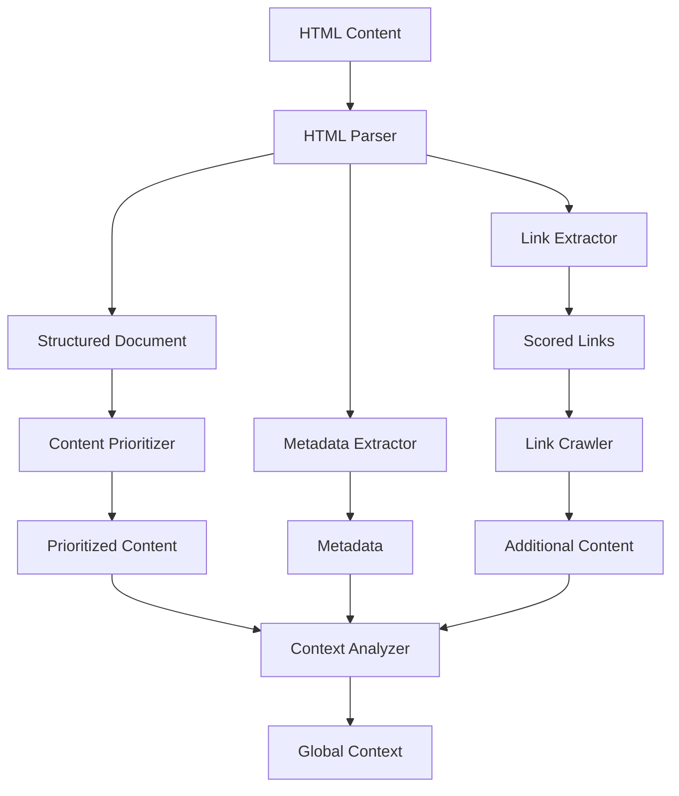

# Enhanced HTML Parser Design

## Overview

The Enhanced HTML Parser is a critical component of the improved context extraction system. It is responsible for processing HTML content from web pages while preserving document structure, extracting metadata, and preparing the content for analysis.

## Architecture



## Key Components

### 1. Structured HTML Parser

The parser transforms raw HTML into a structured representation that preserves the document's semantic structure, including:

- Document hierarchy (headings, sections, etc.)
- Content relationships
- Semantic meaning
- Positional information

```python
class StructuredHTMLDocument:
    """Represents a parsed HTML document with structure preserved."""
    
    def __init__(self):
        self.title = ""
        self.metadata = {}
        self.headings = []  # List of Heading objects with level, text
        self.sections = {}  # Map of section IDs to Section objects
        self.links = []     # List of Link objects
        self.text_blocks = []  # List of TextBlock objects
```

### 2. Content Prioritization Algorithm

The prioritization algorithm scores content sections based on:

1. **Structural importance**:
   - Heading level (h1, h2, etc.)
   - Position in document (header, main content, footer)
   - HTML5 semantic elements (header, main, nav, etc.)

2. **Content signals**:
   - Text length and density
   - Keyword presence and density
   - Presence of product-related terms

3. **Visual prominence** (inferred from HTML):
   - Position in page flow
   - CSS classes suggesting importance (if available)

The scoring formula combines these factors with appropriate weights:

```
score = w1*structural_score + w2*content_score + w3*visual_score

where:
- structural_score depends on tag type, heading level, and containment
- content_score depends on text length, keyword density, and term relevance
- visual_score depends on position and CSS hints
```

### 3. Metadata Extraction

The metadata extractor focuses on gathering product information from:

- `<title>` tag
- `<meta>` tags (especially description, keywords)
- Open Graph (`og:`) meta tags
- JSON-LD structured data
- Microdata annotations

```python
class Metadata:
    """Represents extracted metadata from an HTML document."""
    
    def __init__(self):
        self.title = ""
        self.description = ""
        self.keywords = []
        self.og_metadata = {}  # Open Graph metadata
        self.twitter_metadata = {}  # Twitter card metadata
        self.structured_data = []  # JSON-LD structured data
        self.microdata = {}  # Microdata annotations
```

### 4. Link Analysis System

The link analysis system:

1. Extracts all links from the document
2. Analyzes link context (surrounding text, anchor text)
3. Scores links based on relevance to product concepts
4. Identifies navigation links to key sections

```python
class Link:
    """Represents a link with context and relevance information."""
    
    def __init__(self, url, anchor_text, context_text):
        self.url = url
        self.anchor_text = anchor_text
        self.context_text = context_text
        self.relevance_score = 0.0
        self.link_type = ""  # Navigation, content, external, etc.
```

## Implementation Approach

### HTML Parsing Strategy

The implementation will use BeautifulSoup for HTML parsing, with enhancements to preserve structure:

```python
def parse_html_with_structure(html_content):
    """
    Parse HTML content and preserve document structure.
    
    Args:
        html_content: Raw HTML content as string or bytes
        
    Returns:
        StructuredHTMLDocument object
    """
    document = StructuredHTMLDocument()
    soup = BeautifulSoup(html_content, 'html.parser')
    
    # Extract basic metadata
    document.title = extract_title(soup)
    document.metadata = extract_metadata(soup)
    
    # Extract headings with hierarchy
    document.headings = extract_headings(soup)
    
    # Identify and extract sections
    document.sections = extract_sections(soup)
    
    # Extract text blocks with context
    document.text_blocks = extract_text_blocks(soup)
    
    # Extract links with context
    document.links = extract_links_with_context(soup)
    
    return document
```

### Section Identification

Sections will be identified using:

1. HTML5 semantic elements (`<section>`, `<article>`, etc.)
2. Elements with ID or class attributes
3. Heading-based sections (content between consecutive headings)

```python
def extract_sections(soup):
    """
    Extract sections from the document.
    
    This uses multiple strategies:
    1. HTML5 semantic sections
    2. ID/class-based sections
    3. Heading-based sections
    
    Args:
        soup: BeautifulSoup object
        
    Returns:
        Dictionary mapping section IDs to Section objects
    """
    sections = {}
    
    # Strategy 1: HTML5 semantic sections
    for section_tag in soup.find_all(['section', 'article', 'aside', 'nav', 'header', 'footer', 'main']):
        section = Section(
            id=section_tag.get('id', f"section-{len(sections)}"),
            tag=section_tag.name,
            heading=get_section_heading(section_tag),
            content=get_section_content(section_tag)
        )
        sections[section.id] = section
    
    # Strategy 2: ID/class-based sections
    for element in soup.find_all(id=True):
        if element.name not in ['section', 'article', 'aside', 'nav', 'header', 'footer', 'main']:
            section = Section(
                id=element['id'],
                tag=element.name,
                heading=get_section_heading(element),
                content=get_section_content(element)
            )
            sections[section.id] = section
    
    # Strategy 3: Heading-based sections (if few sections found)
    if len(sections) < 3:
        add_heading_based_sections(soup, sections)
    
    return sections
```

### Content Prioritization Implementation

The content prioritization algorithm will score sections based on multiple factors:

```python
def prioritize_content(structured_document):
    """
    Score and prioritize content sections based on relevance.
    
    Args:
        structured_document: StructuredHTMLDocument object
        
    Returns:
        List of sections sorted by relevance score
    """
    scored_sections = []
    
    for section_id, section in structured_document.sections.items():
        # Calculate structural score
        structural_score = calculate_structural_score(section, structured_document)
        
        # Calculate content score
        content_score = calculate_content_score(section, structured_document)
        
        # Calculate visual score
        visual_score = calculate_visual_score(section, structured_document)
        
        # Combined score
        total_score = (
            WEIGHT_STRUCTURAL * structural_score +
            WEIGHT_CONTENT * content_score +
            WEIGHT_VISUAL * visual_score
        )
        
        # Add to scored sections
        section.relevance_score = total_score
        scored_sections.append(section)
    
    # Sort by score (descending)
    return sorted(scored_sections, key=lambda s: s.relevance_score, reverse=True)
```

### Link Extraction and Scoring

The link extraction process will gather context for each link:

```python
def extract_links_with_context(soup):
    """
    Extract links with their surrounding context.
    
    Args:
        soup: BeautifulSoup object
        
    Returns:
        List of Link objects
    """
    links = []
    
    for a_tag in soup.find_all('a', href=True):
        # Get the URL
        url = a_tag['href']
        
        # Skip fragment-only links and javascript: links
        if url.startswith('#') or url.startswith('javascript:'):
            continue
        
        # Get anchor text
        anchor_text = a_tag.get_text(strip=True)
        
        # Get surrounding context (parent paragraph or list item text)
        context_text = extract_link_context(a_tag)
        
        # Create Link object
        link = Link(url, anchor_text, context_text)
        
        # Determine link type
        link.link_type = determine_link_type(a_tag, url)
        
        links.append(link)
    
    return links
```

The link scoring algorithm will evaluate link relevance:

```python
def score_links(links, product_terms=None):
    """
    Score links based on their relevance to product concepts.
    
    Args:
        links: List of Link objects
        product_terms: Optional list of product-related terms to look for
        
    Returns:
        List of scored Link objects, sorted by relevance
    """
    if not product_terms:
        product_terms = ["feature", "about", "how", "overview", "documentation", 
                        "guide", "tutorial", "concept", "learn"]
    
    for link in links:
        # Base score
        score = 0.0
        
        # Score based on URL structure
        url_score = score_url_structure(link.url)
        score += 0.3 * url_score
        
        # Score based on anchor text
        anchor_score = score_text_relevance(link.anchor_text, product_terms)
        score += 0.4 * anchor_score
        
        # Score based on context text
        context_score = score_text_relevance(link.context_text, product_terms)
        score += 0.3 * context_score
        
        # Adjust for link type
        if link.link_type == "navigation":
            score *= 1.2
        elif link.link_type == "external":
            score *= 0.6
        
        # Set the score
        link.relevance_score = score
    
    # Sort by score (descending)
    return sorted(links, key=lambda l: l.relevance_score, reverse=True)
```

## Integration with Context Extraction System

The HTML Parser will be integrated with the broader context extraction system:

1. The `ContextManager` will use the HTML Parser to process root page content
2. The Link Crawler will use the scored links to fetch additional pages
3. The Context Analyzer will use the structured content to extract context

Interface between components:

```python
# Context Manager uses HTML Parser
def initialize_from_url(self, url):
    """Initialize global context from a URL."""
    # Fetch the content
    content = fetch_url_content(url)
    
    # Parse HTML with structure
    structured_document = parse_html_with_structure(content)
    
    # Prioritize content
    prioritized_sections = prioritize_content(structured_document)
    
    # Extract links and score them
    scored_links = score_links(structured_document.links)
    
    # Follow important links if configured
    if self.follow_links:
        additional_content = self.follow_important_links(
            scored_links[:self.max_links], 
            base_url=url
        )
    else:
        additional_content = []
    
    # Combine content for analysis
    combined_content = prepare_content_for_analysis(
        structured_document, 
        prioritized_sections,
        additional_content
    )
    
    # Extract context
    context = self.analyzer.extract_initial_context(combined_content)
    
    # Validate and store
    self.repository.update_context(context, url)
    
    return context
```

## Performance Considerations

1. **Efficient parsing**: Use lxml for faster parsing of large documents
2. **Incremental processing**: Process sections as they're identified
3. **Parallel link processing**: Crawl important links in parallel
4. **Caching**: Cache parsed documents to avoid re-parsing

## Error Handling

The parser will be robust against common HTML issues:

1. **Malformed HTML**: Use lenient parsing mode
2. **Missing structure**: Fall back to heading-based section extraction
3. **Encoding issues**: Handle multiple encodings gracefully
4. **JavaScript-dependent content**: Extract visible text even without JS execution

## Testing Strategy

The HTML Parser will have thorough tests:

1. **Unit tests** for each parsing function
2. **Integration tests** with the context manager
3. **Property-based tests** to verify structure preservation
4. **Benchmark tests** for performance on large documents

## Implementation Schedule

The implementation should proceed in this order:

1. Basic structure preservation parser
2. Metadata extraction
3. Section identification
4. Content prioritization
5. Link analysis and scoring
6. Integration with context manager

## Conclusion

This enhanced HTML parser design provides a solid foundation for extracting high-quality context from web pages. By preserving document structure, prioritizing content sections, and analyzing links, the parser will enable the context extraction system to build a comprehensive understanding of products from their documentation.