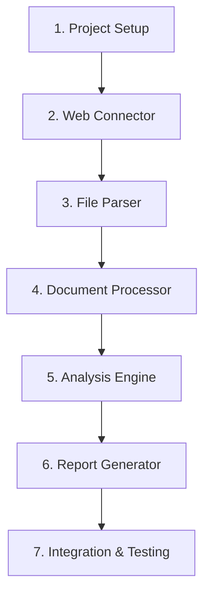

# Document-it Implementation Path

## Overview
This document outlines the development sequence for the Document-it project, a tool that connects to a website, retrieves document references, analyzes them using LangGraph with GPT-4o, and generates implementation guidelines.

## Development Sequence

## Implementation Steps

### 1. Project Setup
- Install required dependencies
- Update pyproject.toml
- Create basic project structure

**Deliverable:** Working project scaffold with all directories created
**Checkpoint:** Verify dependencies can be installed with no errors
**Documentation:** Review the project structure document

### 2. Web Connector Implementation
- Follow the guidelines in `web_connector.md`
- Focus on reliable web access and file downloading

**Deliverable:** Working connector that can download files from specified URLs
**Checkpoint:** Successfully download llms.txt from https://docs.agno.com/llms.txt
**Documentation:** Ensure functions are properly documented

### 3. File Parser Implementation
- Follow the guidelines in `file_parser.md`
- Ensure robust parsing of markdown-formatted link lists

**Deliverable:** Parser that extracts all document URLs from the llms.txt file
**Checkpoint:** Verify parser can handle various markdown link formats
**Documentation:** Document the parser's output format

### 4. Document Processor Implementation
- Follow the guidelines in `document_processor.md`
- Build systematic document organization

**Deliverable:** System to download and organize all referenced documents
**Checkpoint:** All documents are properly downloaded and categorized
**Documentation:** Document the storage structure

### 5. Analysis Engine Implementation
- Follow the guidelines in `analysis_engine.md` 
- Focus on effective LangGraph configuration with GPT-4o

**Deliverable:** Working analysis system using LangGraph
**Checkpoint:** Verify analysis results capture key information from documents
**Documentation:** Document prompts and analysis workflow

### 6. Report Generator Implementation
- Follow the guidelines in `report_generator.md`
- Ensure clear, structured markdown output

**Deliverable:** System to generate implementation guidelines in markdown
**Checkpoint:** Review output for clarity and completeness
**Documentation:** Document the report template structure

### 7. Integration & Testing
- Connect all components
- Perform end-to-end testing
- Optimize performance

**Deliverable:** Fully functional Document-it application
**Checkpoint:** Application successfully processes llms.txt and produces guidelines
**Documentation:** Final system documentation

## Development Guidelines

1. **Pause and Review:** After completing each major component, pause for review before continuing to the next phase

2. **Incremental Testing:** Test each component individually before integration

3. **Documentation:** Document as you go - every function should have clear docstrings

4. **Error Handling:** Implement robust error handling at each step

5. **Conclusion Notes:** At the end of each component, write brief conclusions about:
   - What was implemented
   - Any design decisions made
   - Potential improvements for the future

## Next Steps

Begin by setting up the project structure and implementing the Web Connector component. After completing and testing this component, document your findings and request continuation instructions.