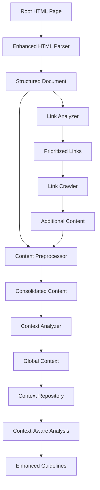
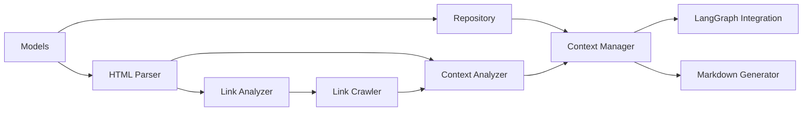

# Implementation Plan: Improved Global Context Management

## Overview

This document outlines the implementation plan for enhancing the global context management system in document-it. The goal is to address the current limitations where deep links lose context of the global subject of the documentation being analyzed.

## System Architecture

## Component Overview

We have designed several key components:

1. **Enhanced HTML Parser** ([html_parser_design.md](html_parser_design.md))
   - Preserves document structure during parsing
   - Implements content prioritization algorithm
   - Extracts metadata and section organization

2. **Link Crawler** ([link_crawler_design.md](link_crawler_design.md))
   - Intelligently selects relevant links to follow
   - Implements controlled depth crawling (depth=1)
   - Consolidates content from multiple pages

3. **Context Analyzer** ([context_analyzer_design.md](context_analyzer_design.md))
   - Multi-stage analysis process
   - Extracts product information, features, and terminology
   - Implements validation and fallback mechanisms

4. **Functional Tests** ([context_extraction_tests.md](context_extraction_tests.md))
   - Comprehensive test suite for the context extraction pipeline
   - Mock fixtures for different website types
   - Validation tests for context quality

## Implementation Phases

### Phase 1: Core Infrastructure (Week 1)

**Objective:** Establish the basic structure and models for the improved context system.

**Tasks:**
1. Create `context` package structure
2. Implement `GlobalContext` and related models
3. Create basic `ContextRepository` for storage
4. Implement test fixtures for HTML content
5. Set up CI pipeline for testing

**Deliverables:**
- `context/models.py` - Data models for context
- `context/context_repository.py` - Storage and retrieval
- `tests/context/test_models.py` - Unit tests for models
- `tests/fixtures/html_fixtures.py` - Test HTML content

### Phase 2: HTML Parsing (Week 1-2)

**Objective:** Build the enhanced HTML parser with structure preservation.

**Tasks:**
1. Implement structured HTML document parser
2. Create section identification logic
3. Develop metadata extraction
4. Implement content prioritization algorithm
5. Create unit tests for all components

**Deliverables:**
- `context/html_parser.py` - Enhanced HTML parser
- `context/content_prioritizer.py` - Content scoring system
- `tests/context/test_html_parser.py` - Parser tests

### Phase 3: Link Analysis & Crawling (Week 2)

**Objective:** Build the link analysis and controlled crawling system.

**Tasks:**
1. Implement link extraction with context
2. Create link scoring algorithm
3. Develop controlled depth crawler
4. Implement content consolidation
5. Create unit tests for crawler

**Deliverables:**
- `context/link_analyzer.py` - Link analysis and scoring
- `context/link_crawler.py` - Controlled crawler
- `context/content_consolidator.py` - Content consolidation
- `tests/context/test_link_crawler.py` - Crawler tests

### Phase 4: Context Analysis (Week 3)

**Objective:** Implement the multi-stage context analysis system.

**Tasks:**
1. Develop content preprocessor
2. Implement multi-stage analyzer
3. Create context builder
4. Implement context validation
5. Develop fallback analyzer
6. Create comprehensive tests

**Deliverables:**
- `context/content_preprocessor.py` - Content preparation
- `context/context_analyzer.py` - Multi-stage analyzer
- `context/context_validator.py` - Validation system
- `tests/context/test_context_analyzer.py` - Analyzer tests

### Phase 5: Integration (Week 3-4)

**Objective:** Integrate new components with existing system.

**Tasks:**
1. Update `ContextManager` to use new components
2. Modify main application to initialize context from root page
3. Update LangGraph agent to incorporate global context
4. Enhance markdown generator to include context in guidelines
5. Create integration tests

**Deliverables:**
- Updated `context/context_manager.py`
- Updated `main.py`
- Updated `analysis/langgraph_agent.py`
- Updated `reporting/markdown_generator.py`
- `tests/integration/test_context_extraction.py`

### Phase 6: Functional Testing & Optimization (Week 4)

**Objective:** Validate complete system and optimize performance.

**Tasks:**
1. Implement functional tests
2. Test with various real websites
3. Optimize performance
4. Fix any issues
5. Document the system

**Deliverables:**
- `tests/functional/test_context_extraction.py`
- Performance optimization report
- Updated documentation

## Dependencies Between Components

## Required Changes to Existing Code

### 1. `main.py`
- Add command-line options for root page URL and context directory
- Implement root page downloading and parsing
- Initialize global context from root page
- Export global context summary

### 2. `analysis/langgraph_agent.py`
- Update `WorkflowState` to include global context
- Modify analysis workflow to incorporate context
- Update analysis prompts to be context-aware
- Add context validation node

### 3. `reporting/markdown_generator.py`
- Enhance guideline generation to include product context
- Add global context summary to index document
- Reference product features in topic guidelines

## New Files to Create

### Models and Storage
- `context/models.py`
- `context/context_repository.py`

### HTML Processing
- `context/html_parser.py`
- `context/content_prioritizer.py`

### Link Crawling
- `context/link_analyzer.py`
- `context/link_crawler.py`
- `context/content_consolidator.py`

### Context Analysis
- `context/content_preprocessor.py`
- `context/context_analyzer.py`
- `context/context_validator.py`

### Integration
- `context/context_manager.py`
- `context/__init__.py`

### Tests
- `tests/context/test_models.py`
- `tests/context/test_repository.py`
- `tests/context/test_html_parser.py`
- `tests/context/test_link_crawler.py`
- `tests/context/test_context_analyzer.py`
- `tests/integration/test_context_extraction.py`
- `tests/functional/test_context_extraction.py`

## Testing Strategy

### Unit Tests
- Each component should have comprehensive unit tests
- Use mock objects for external dependencies
- Test edge cases and error handling

### Integration Tests
- Test interaction between components
- Validate entire context extraction pipeline
- Test with mock server and HTML fixtures

### Functional Tests
- Test with realistic HTML content
- Validate context quality metrics
- Test recovery from failures

## Success Criteria

1. **Context Completeness**
   - Product name and description correctly extracted
   - Features identified with accurate descriptions
   - Terminology properly captured

2. **Link Analysis Accuracy**
   - Relevant links identified and prioritized
   - Controlled depth enforced
   - Content properly consolidated

3. **Context Integration**
   - Global context correctly incorporated into analysis
   - Context-aware guidelines generated
   - Context enriched as more documents analyzed

4. **System Robustness**
   - Graceful handling of malformed HTML
   - Recovery from analysis failures
   - Fallback mechanisms working correctly

## Resource Requirements

- OpenAI API key with sufficient quota
- Testing infrastructure for mock web server
- CI/CD integration for automated testing

## Conclusion

This implementation plan provides a structured approach to building the improved global context management system. By following the phased implementation and focusing on comprehensive testing, we will deliver a robust solution that addresses the context loss issue in deep links.

The new system will extract rich context from product root pages, intelligently follow important links to gather additional information, and maintain this context throughout the documentation analysis process, resulting in more coherent and comprehensive implementation guidelines.