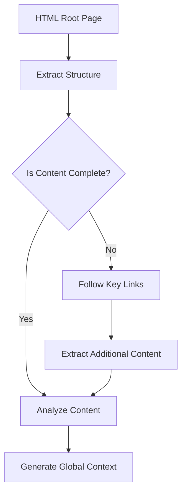
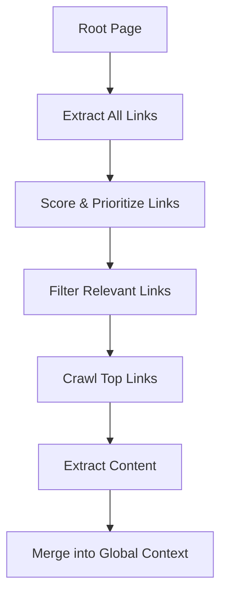
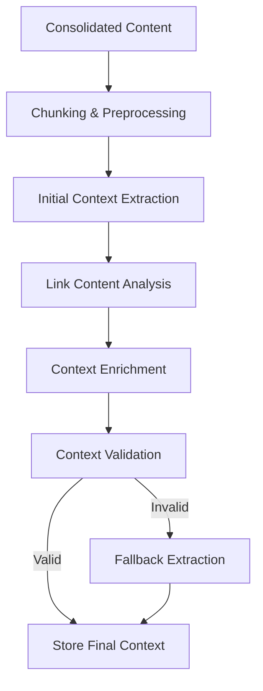
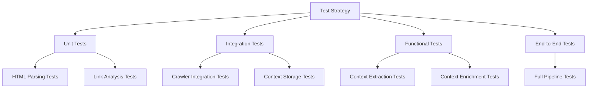
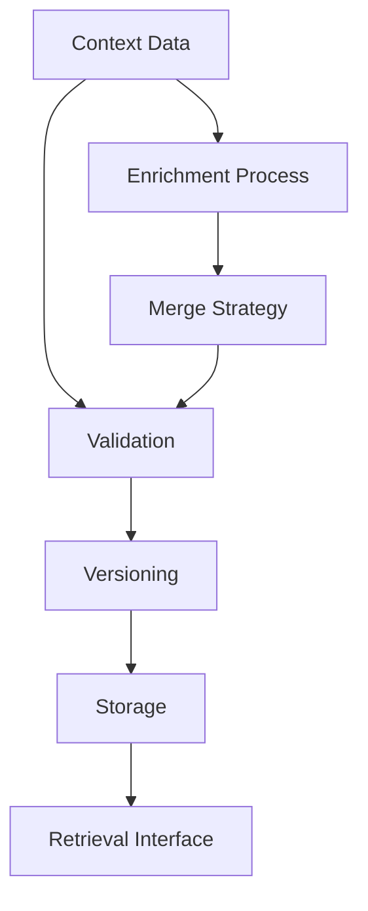

# Improved Global Context Management in document-it

## Problem Analysis

The current implementation of global context management is not functioning correctly:

1. **Empty context**: The system isn't properly extracting meaningful context from the root page
2. **Insufficient HTML analysis**: We need more sophisticated parsing of the HTML structure 
3. **Missing follow-up content**: We're not crawling important concept links to build a complete context
4. **Lack of validation**: We need functional tests to verify our context extraction pipeline

## Detailed Implementation Plan

### 1. Enhanced HTML Content Analysis



#### Implementation Steps:
1. **Improve HTML parsing**:
   - Preserve document structure (headings, sections, navigation)
   - Extract and prioritize content from key sections (About, Features, Documentation)
   - Process metadata (title, meta tags, Open Graph tags)
   - Use HTML5 semantic elements to identify important content

2. **Content prioritization algorithm**:
   - Score content sections based on relevance signals (position, heading level, keywords)
   - Extract product name, tagline, and descriptions from prominent positions
   - Identify feature listings and product benefits

### 2. Intelligent Link Crawling System



#### Implementation Steps:
1. **Link analysis**:
   - Extract all links from the root page
   - Score links based on:
     - Link text (keywords like "features", "about", "concepts")
     - Link context (surrounding text)
     - URL structure (paths suggesting key content)
   - Prioritize navigation links to main concept pages

2. **Controlled crawling**:
   - Implement a crawler with strict depth=1 limit
   - Add rate limiting and politeness policies
   - Process 5-10 highest-priority links only
   - Handle different content types (HTML, markdown, etc.)

3. **Content consolidation**:
   - Merge content from concept pages with root page content
   - Resolve conflicts with recency/specificity rules
   - Maintain traceability of source URLs

### 3. Context Analyzer Improvements



#### Implementation Steps:
1. **Enhance LLM prompts**:
   - Develop specialized prompts for different content sections
   - Use system prompts that explain HTML structure importance
   - Include examples of good context extraction

2. **Multi-stage analysis**:
   - First pass: Extract key product information and structure
   - Second pass: Analyze detailed features and concepts
   - Third pass: Synthesize and validate context

3. **Validation mechanism**:
   - Check for completeness of required fields
   - Validate context against expected patterns
   - Implement fallback extraction for missing components

### 4. Comprehensive Testing Strategy



#### Implementation Steps:
1. **Create test fixtures**:
   - Sample HTML pages representing different product types
   - Mock responses for link crawling
   - Expected context outputs for validation

2. **Develop functional tests**:
   - Test the HTML parsing and text extraction
   - Test link extraction and prioritization
   - Test crawling with controlled depth
   - Test context analysis with known inputs
   - Test the complete context extraction pipeline

3. **Validation tests**:
   - Test empty/malformed HTML handling
   - Test context merging with conflicting information
   - Test recovery from analysis failures

### 5. Context Storage and Versioning



#### Implementation Steps:
1. **Improve storage system**:
   - Add validation before storage to prevent empty contexts
   - Implement versioning with timestamps
   - Track source URLs for each context component

2. **Enhance context repository**:
   - Add methods for partial updates
   - Implement conflict resolution
   - Add diagnostics to track context quality

## Implementation Sequence

The implementation should follow this sequence:

1. **Phase 1: Test Infrastructure**
   - Develop functional tests for each component
   - Create test fixtures and mock servers
   - Establish baseline metrics for context quality

2. **Phase 2: HTML Processing**
   - Enhance HTML parsing with structure preservation
   - Implement content prioritization
   - Add metadata extraction

3. **Phase 3: Link Crawler**
   - Implement link extraction and scoring
   - Build controlled crawling system
   - Add content consolidation

4. **Phase 4: Context Analysis**
   - Improve LLM prompts
   - Implement multi-stage analysis
   - Add validation mechanisms

5. **Phase 5: Storage & Integration**
   - Enhance context repository
   - Integrate all components
   - Validate with end-to-end tests

## Functional Test Suite Design

### Test Modules

1. **HTML Extraction Tests**
```python
def test_html_structure_preservation():
    """Test that HTML structure is preserved during parsing."""
    # Given: An HTML page with structured content
    # When: The parser processes the HTML
    # Then: The parsed output should maintain heading hierarchy and section relationships

def test_metadata_extraction():
    """Test that metadata is properly extracted from HTML."""
    # Given: An HTML page with meta tags, title, OG tags
    # When: The parser processes the HTML
    # Then: All metadata should be correctly extracted

def test_content_prioritization():
    """Test that content is prioritized correctly."""
    # Given: An HTML page with various content sections
    # When: The content prioritization algorithm runs
    # Then: High-value sections should receive higher scores
```

2. **Link Analysis Tests**
```python
def test_link_extraction():
    """Test that all links are extracted from the page."""
    # Given: An HTML page with various types of links
    # When: The link extractor processes the page
    # Then: All links should be extracted with their context

def test_link_scoring():
    """Test that links are scored correctly based on relevance."""
    # Given: A set of links with different texts and contexts
    # When: The link scoring algorithm runs
    # Then: Links to concept pages should score higher than external or utility links
```

3. **Crawler Tests**
```python
def test_controlled_depth_crawling():
    """Test that the crawler respects the depth limit."""
    # Given: A website with nested links
    # When: The crawler runs with depth=1
    # Then: Only direct links from the root page should be crawled

def test_content_consolidation():
    """Test that content from multiple pages is properly consolidated."""
    # Given: Content from multiple related pages
    # When: The consolidation process runs
    # Then: A coherent, merged representation should be created
```

4. **Context Analysis Tests**
```python
def test_context_extraction_quality():
    """Test that high-quality context is extracted from content."""
    # Given: Preprocessed content from a product website
    # When: The context analyzer processes the content
    # Then: The extracted context should accurately represent the product

def test_context_validation():
    """Test that context validation identifies incomplete contexts."""
    # Given: An incomplete context object
    # When: The validation process runs
    # Then: Validation should fail and identify missing components
```

5. **End-to-End Tests**
```python
def test_complete_context_pipeline():
    """Test the entire context extraction pipeline."""
    # Given: A product website URL
    # When: The complete pipeline runs
    # Then: A valid, comprehensive context should be generated
```

## Expected Deliverables

1. Enhanced HTML parsing module
2. Link extraction and scoring system
3. Controlled depth crawler
4. Improved context analyzer with validation
5. Enhanced context storage system
6. Comprehensive test suite
7. Documentation of the context extraction process

## Success Criteria

1. Context extraction succeeds on 95% of test sites
2. Generated context includes:
   - Accurate product name and description
   - Comprehensive feature list
   - Relevant terminology
   - Proper categorization
3. All functional tests pass
4. Link crawling respects depth limitations
5. Context enrichment improves with additional documents