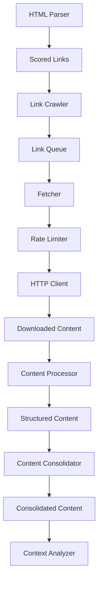

# Link Crawler Design

## Overview

The Link Crawler is a critical component of the context extraction system responsible for intelligently following links from the root page to gather comprehensive information about the product. It implements a controlled crawling approach to gather context from key product pages without going too deep into the site structure.

## Architecture



## Design Principles

1. **Controlled Depth**: Only follow links one level deep from the root page
2. **Intelligent Selection**: Only follow the most relevant links based on scoring
3. **Politeness**: Implement proper rate limiting and respect robots.txt
4. **Content Focus**: Prioritize pages with rich product information
5. **Efficiency**: Process pages in parallel where appropriate
6. **Robustness**: Handle errors gracefully without breaking the pipeline
7. **Traceability**: Track where information came from for context enrichment

## Core Components

### 1. Link Selector

Responsible for choosing which links to follow based on relevance scores:

```python
class LinkSelector:
    """Selects the most relevant links to follow."""
    
    def __init__(self, max_links=5, min_score=0.4):
        """
        Initialize the link selector.
        
        Args:
            max_links: Maximum number of links to select
            min_score: Minimum relevance score to consider
        """
        self.max_links = max_links
        self.min_score = min_score
    
    def select_links(self, scored_links, base_url):
        """
        Select links to follow.
        
        Args:
            scored_links: List of scored Link objects
            base_url: Base URL for resolving relative links
            
        Returns:
            List of selected Link objects with absolute URLs
        """
        # Filter links by score
        qualified_links = [l for l in scored_links if l.relevance_score >= self.min_score]
        
        # Take top N links
        selected_links = qualified_links[:self.max_links]
        
        # Convert to absolute URLs
        for link in selected_links:
            link.url = self._make_absolute_url(link.url, base_url)
        
        return selected_links
    
    def _make_absolute_url(self, url, base_url):
        """Convert relative URL to absolute."""
        from urllib.parse import urljoin
        return urljoin(base_url, url)
```

### 2. Crawler Controller

Controls the crawling process with rate limiting and parallel processing:

```python
class CrawlerController:
    """Controls the crawling process."""
    
    def __init__(self, 
                 max_concurrent=3, 
                 rate_limit=1,  # Requests per second
                 timeout=10,
                 respect_robots=True):
        """
        Initialize the crawler controller.
        
        Args:
            max_concurrent: Maximum concurrent requests
            rate_limit: Maximum requests per second
            timeout: Request timeout in seconds
            respect_robots: Whether to respect robots.txt
        """
        self.max_concurrent = max_concurrent
        self.rate_limit = rate_limit
        self.timeout = timeout
        self.respect_robots = respect_robots
        self.visited_urls = set()
        self._robots_parsers = {}  # Cache for robots.txt parsers
    
    async def crawl(self, links):
        """
        Crawl the selected links.
        
        Args:
            links: List of Link objects to crawl
            
        Returns:
            List of (Link, Content) tuples
        """
        import asyncio
        from aiohttp import ClientSession
        from urllib.parse import urlparse
        
        # Create semaphore for concurrency control
        semaphore = asyncio.Semaphore(self.max_concurrent)
        
        # Create rate limiter
        rate_limiter = RateLimiter(self.rate_limit)
        
        # Filter out already visited URLs
        new_links = [link for link in links if link.url not in self.visited_urls]
        
        # Check robots.txt if enabled
        if self.respect_robots:
            allowed_links = []
            for link in new_links:
                if await self._is_allowed_by_robots(link.url):
                    allowed_links.append(link)
            new_links = allowed_links
        
        # Create tasks for each link
        async with ClientSession() as session:
            tasks = []
            for link in new_links:
                task = asyncio.create_task(
                    self._fetch_with_rate_limit(
                        session, link, semaphore, rate_limiter
                    )
                )
                tasks.append(task)
            
            # Wait for all tasks to complete
            results = await asyncio.gather(*tasks, return_exceptions=True)
        
        # Process results
        crawled_pages = []
        for link, result in zip(new_links, results):
            self.visited_urls.add(link.url)
            
            if isinstance(result, Exception):
                # Log error and continue
                continue
                
            crawled_pages.append((link, result))
        
        return crawled_pages
    
    async def _fetch_with_rate_limit(self, session, link, semaphore, rate_limiter):
        """Fetch a URL with rate limiting and concurrency control."""
        async with semaphore:
            await rate_limiter.wait()
            
            try:
                async with session.get(link.url, timeout=self.timeout) as response:
                    if response.status == 200:
                        content = await response.read()
                        return content
                    else:
                        # Handle non-200 responses
                        return None
            except Exception as e:
                # Log exception and propagate
                raise e
    
    async def _is_allowed_by_robots(self, url):
        """Check if URL is allowed by robots.txt."""
        from urllib.parse import urlparse
        from urllib.robotparser import RobotFileParser
        
        parsed_url = urlparse(url)
        base_url = f"{parsed_url.scheme}://{parsed_url.netloc}"
        
        # Check cache first
        if base_url in self._robots_parsers:
            parser = self._robots_parsers[base_url]
        else:
            # Fetch and parse robots.txt
            parser = RobotFileParser()
            parser.set_url(f"{base_url}/robots.txt")
            try:
                parser.read()
                self._robots_parsers[base_url] = parser
            except:
                # If robots.txt cannot be fetched, assume allowed
                return True
        
        # Check if crawling is allowed
        path = parsed_url.path
        if not path:
            path = "/"
        
        return parser.can_fetch("document-it", path)
```

### 3. Content Processor

Processes the HTML content from crawled pages:

```python
class ContentProcessor:
    """Processes HTML content from crawled pages."""
    
    def __init__(self):
        """Initialize the content processor."""
        from document_it.context.html_parser import parse_html_with_structure
        self.html_parser = parse_html_with_structure
    
    def process(self, crawled_pages):
        """
        Process crawled pages.
        
        Args:
            crawled_pages: List of (Link, Content) tuples
            
        Returns:
            List of (Link, StructuredDocument) tuples
        """
        processed_pages = []
        
        for link, content in crawled_pages:
            try:
                # Detect content type
                content_type = self._detect_content_type(content, link.url)
                
                if content_type == "html":
                    # Parse HTML with structure
                    structured_document = self.html_parser(content)
                    processed_pages.append((link, structured_document))
                elif content_type == "markdown":
                    # Parse markdown
                    structured_document = self._parse_markdown(content)
                    processed_pages.append((link, structured_document))
                else:
                    # Unsupported content type
                    continue
            except Exception as e:
                # Log error and continue
                continue
        
        return processed_pages
    
    def _detect_content_type(self, content, url):
        """Detect content type from content and URL."""
        # Simple content type detection based on URL and content
        if url.endswith(".md") or url.endswith(".markdown"):
            return "markdown"
        
        # Check if content appears to be HTML
        if content.startswith(b"<!DOCTYPE html>") or b"<html" in content[:1000]:
            return "html"
        
        # Default to HTML
        return "html"
    
    def _parse_markdown(self, content):
        """Parse markdown content into a structured document."""
        # Convert markdown to a structured document format
        # (This would need to be implemented)
        from document_it.parser.markdown_parser import parse_markdown
        return parse_markdown(content)
```

### 4. Content Consolidator

Consolidates content from multiple pages:

```python
class ContentConsolidator:
    """Consolidates content from multiple pages."""
    
    def __init__(self):
        """Initialize the content consolidator."""
        pass
    
    def consolidate(self, root_document, processed_pages):
        """
        Consolidate content from multiple pages.
        
        Args:
            root_document: StructuredDocument for the root page
            processed_pages: List of (Link, StructuredDocument) tuples for linked pages
            
        Returns:
            Consolidated content dictionary for context extraction
        """
        # Initialize consolidated content
        consolidated = {
            "root_page": self._document_to_dict(root_document),
            "linked_pages": [],
            "global_sections": {
                "features": [],
                "about": [],
                "concepts": [],
                "terminology": [],
            }
        }
        
        # Process each linked page
        for link, document in processed_pages:
            # Convert to dictionary format
            page_dict = self._document_to_dict(document)
            page_dict["url"] = link.url
            page_dict["relevance_score"] = link.relevance_score
            
            # Add to linked pages
            consolidated["linked_pages"].append(page_dict)
            
            # Extract sections based on URL patterns and link text
            self._categorize_and_extract_sections(consolidated, link, document)
        
        return consolidated
    
    def _document_to_dict(self, document):
        """Convert StructuredDocument to dictionary."""
        return {
            "title": document.title,
            "metadata": document.metadata,
            "headings": [h.__dict__ for h in document.headings],
            "sections": {id: s.__dict__ for id, s in document.sections.items()},
        }
    
    def _categorize_and_extract_sections(self, consolidated, link, document):
        """Categorize and extract sections from a document."""
        # Check URL patterns
        url = link.url.lower()
        
        # Features section
        if "feature" in url or "feature" in link.anchor_text.lower():
            self._extract_feature_sections(consolidated, document)
        
        # About section
        if "about" in url or "about" in link.anchor_text.lower():
            self._extract_about_sections(consolidated, document)
        
        # Concept sections
        if any(term in url or term in link.anchor_text.lower() 
               for term in ["concept", "guide", "doc", "tutorial"]):
            self._extract_concept_sections(consolidated, document)
        
        # Terminology sections
        if "terminology" in url or "glossary" in url:
            self._extract_terminology_sections(consolidated, document)
    
    def _extract_feature_sections(self, consolidated, document):
        """Extract feature sections from a document."""
        # Look for feature sections based on headings and content
        feature_sections = []
        
        # Find sections that describe features
        for section_id, section in document.sections.items():
            section_text = section.content.lower()
            section_heading = section.heading.lower() if section.heading else ""
            
            if (any(word in section_heading for word in ["feature", "capability", "function"]) or
                (section.tag in ["article", "section"] and 
                 any(word in section_text for word in ["feature", "capability", "function"]))):
                
                feature_sections.append({
                    "name": section.heading,
                    "content": section.content,
                    "id": section_id
                })
        
        # Add to consolidated content
        consolidated["global_sections"]["features"].extend(feature_sections)
    
    # Similar methods for extracting about, concept, and terminology sections
    # ...
```

### 5. Rate Limiter

Ensures the crawler doesn't overwhelm target servers:

```python
class RateLimiter:
    """Rate limits requests to respect target servers."""
    
    def __init__(self, requests_per_second):
        """
        Initialize the rate limiter.
        
        Args:
            requests_per_second: Maximum requests per second
        """
        self.period = 1.0 / requests_per_second
        self.last_request_time = 0
    
    async def wait(self):
        """Wait for the appropriate time to make the next request."""
        import asyncio
        import time
        
        current_time = time.time()
        elapsed = current_time - self.last_request_time
        
        if elapsed < self.period:
            await asyncio.sleep(self.period - elapsed)
        
        self.last_request_time = time.time()
```

## Integration with Context Extraction System

The Link Crawler integrates with other components:

```python
# In ContextManager
def initialize_from_url(self, url):
    """Initialize global context from a URL."""
    # Fetch and parse root page
    root_content = fetch_url_content(url)
    structured_document = parse_html_with_structure(root_content)
    
    # Extract and score links
    scored_links = score_links(structured_document.links)
    
    # Follow important links if configured
    if self.follow_links:
        # Select links to follow
        link_selector = LinkSelector(max_links=self.max_links)
        selected_links = link_selector.select_links(scored_links, url)
        
        # Crawl selected links
        crawler = CrawlerController(
            max_concurrent=self.max_concurrent,
            rate_limit=self.rate_limit,
            respect_robots=self.respect_robots
        )
        crawled_pages = await crawler.crawl(selected_links)
        
        # Process crawled pages
        content_processor = ContentProcessor()
        processed_pages = content_processor.process(crawled_pages)
        
        # Consolidate content
        consolidator = ContentConsolidator()
        consolidated_content = consolidator.consolidate(
            structured_document, processed_pages
        )
    else:
        # Use only root page content
        consolidated_content = {
            "root_page": structured_document_to_dict(structured_document),
            "linked_pages": [],
            "global_sections": {}
        }
    
    # Extract context from consolidated content
    context = self.analyzer.extract_initial_context(consolidated_content)
    
    # Store context
    self.repository.update_context(context, url)
    
    return context
```

## Configuration Options

The Link Crawler supports several configuration options:

1. **`max_links`**: Maximum number of links to follow (default: 5)
2. **`min_score`**: Minimum relevance score for links to follow (default: 0.4)
3. **`max_concurrent`**: Maximum concurrent requests (default: 3)
4. **`rate_limit`**: Maximum requests per second (default: 1)
5. **`timeout`**: Request timeout in seconds (default: 10)
6. **`respect_robots`**: Whether to respect robots.txt (default: True)

These options can be adjusted based on the needs of the specific deployment.

## Error Handling

The Link Crawler implements robust error handling:

1. **Network errors**: Catch and log network errors, continue with other links
2. **Parsing errors**: Handle malformed HTML gracefully
3. **Timeout handling**: Set appropriate timeouts to avoid hanging
4. **Rate limiting**: Back off if receiving too many requests errors
5. **Content type handling**: Detect and handle various content types

## Testing Strategy

The Link Crawler will have comprehensive tests:

1. **Unit tests** for each component (LinkSelector, CrawlerController, etc.)
2. **Integration tests** with mock web server
3. **Concurrency tests** to verify proper rate limiting
4. **Robots.txt compliance tests**
5. **Error handling tests** with various error conditions

Example test cases:

```python
def test_link_selection():
    """Test that the link selector correctly chooses links."""
    links = [
        Link("products.html", "Products", "", relevance_score=0.9),
        Link("about.html", "About", "", relevance_score=0.8),
        Link("contact.html", "Contact", "", relevance_score=0.3),
    ]
    
    selector = LinkSelector(max_links=2, min_score=0.5)
    selected = selector.select_links(links, "https://example.com")
    
    assert len(selected) == 2
    assert "https://example.com/products.html" in [l.url for l in selected]
    assert "https://example.com/about.html" in [l.url for l in selected]
    assert "https://example.com/contact.html" not in [l.url for l in selected]

async def test_crawler_rate_limiting():
    """Test that the crawler respects rate limits."""
    # Setup mock server
    # ...
    
    # Create crawler with specific rate limit
    crawler = CrawlerController(rate_limit=2)  # 2 requests per second
    
    # Record start time
    start_time = time.time()
    
    # Crawl 5 links
    links = [Link(f"https://example.com/page{i}", f"Page {i}", "") for i in range(5)]
    await crawler.crawl(links)
    
    # Check duration
    duration = time.time() - start_time
    
    # Should take at least 2 seconds for 5 requests at 2/second
    assert duration >= 2.0
```

## Limitations

1. **JavaScript-rendered content**: The crawler doesn't execute JavaScript, so content rendered by JS won't be captured
2. **Depth limitation**: Only follows links one level deep
3. **Content types**: Limited support for different content types

## Implementation Schedule

The Link Crawler implementation should proceed in this order:

1. **Phase 1**: LinkSelector and basic URL fetching
2. **Phase 2**: Rate limiting and concurrency control
3. **Phase 3**: Content processing for different formats
4. **Phase 4**: Content consolidation
5. **Phase 5**: Integration with context extraction

## Conclusion

The Link Crawler design provides a controlled and intelligent way to gather additional context from related pages. By carefully selecting which links to follow and consolidating information from multiple sources, it enables the context extraction system to build a more comprehensive understanding of the product.