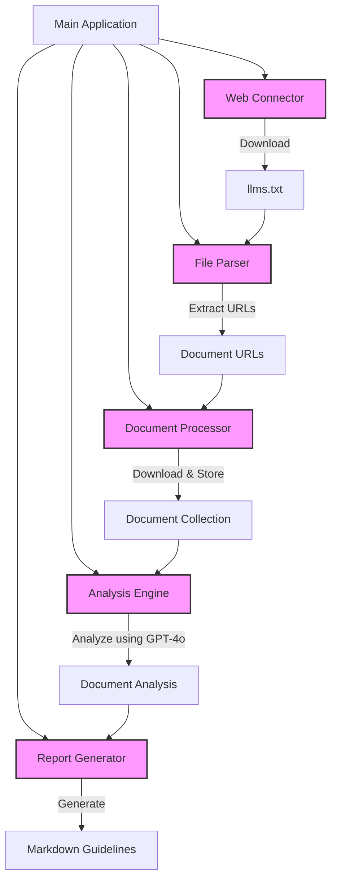
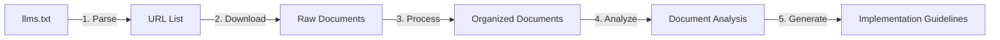
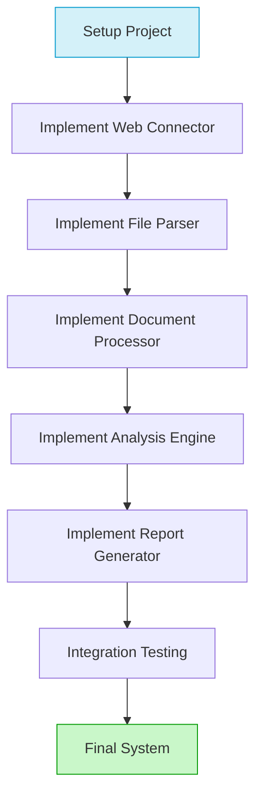

# Document-it: System Overview

## Project Purpose
Document-it is a tool designed to connect to a website, retrieve document references from llms.txt, download and analyze those documents using LangGraph with GPT-4o, and generate comprehensive implementation guidelines in markdown format.

## System Architecture

## Data Flow

## Component Relationships

| Component          | Inputs                        | Outputs                    | Dependencies               |
|--------------------|-------------------------------|----------------------------|----------------------------|
| Web Connector      | URLs                          | Downloaded Files           | requests                   |
| File Parser        | llms.txt content              | Document URLs & Structure  | regex, URL validation      |
| Document Processor | Document URLs                 | Organized Document Storage | Web Connector              |
| Analysis Engine    | Document Collection           | Document Analysis          | LangGraph, OpenAI GPT-4o   |
| Report Generator   | Analysis Results              | Markdown Guidelines        | Markdown templating        |

## Key Implementation Guidelines

Each component has specific implementation guidelines documented in detail:

1. [Project Setup](project_setup.md) - Setting up the project structure and dependencies
2. [Implementation Path](implementation_path.md) - Overall development sequence
3. [Web Connector](web_connector.md) - Website connection and file download
4. [File Parser](file_parser.md) - Parsing llms.txt to extract document references
5. [Document Processor](document_processor.md) - Processing and organizing documents
6. [Analysis Engine](analysis_engine.md) - LangGraph integration with GPT-4o
7. [Report Generator](report_generator.md) - Creating implementation guidelines

## Development Workflow

## Getting Started

1. Begin by reviewing the [Project Setup](project_setup.md) document to set up the project structure
2. Follow the [Implementation Path](implementation_path.md) for a step-by-step development guide
3. Implement each component according to its specific documentation
4. After completing each component, document your progress and request continuation instructions

## Implementation Approach

This project follows a component-based architecture where each component has:

- Clearly defined responsibilities
- Well-defined interfaces
- Specific inputs and outputs
- Comprehensive error handling
- Unit tests

When implementing, focus on:

1. **Modularity**: Each component should be independent and replaceable
2. **Error Handling**: Implement robust error handling at each step
3. **Testing**: Write tests for each component before integrating
4. **Documentation**: Document your code and design decisions
5. **Incremental Development**: Complete one component before moving to the next

## Next Steps

Start by setting up the project structure as described in [Project Setup](project_setup.md), then implement the Web Connector component following the guidelines in [Web Connector](web_connector.md).